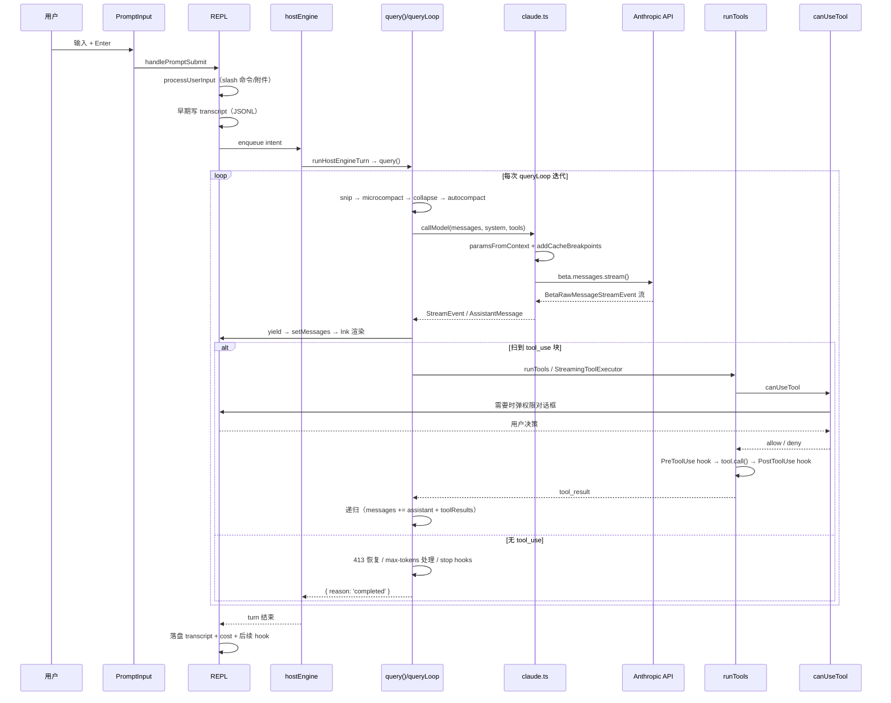

# 项目交接文档 — Claude Code 源码重建版

> 生成时间：2026-08-23 · 基线 commit `f5987063` · 分支 `main` · npm 版本 `2.7.45`
>
> 本文档面向**接手这个仓库的工程师**。目标是让你在不看完 100 万行代码的前提下，
> 理解「一次用户输入是如何变成模型调用和工具执行的」，以及「每个子系统在哪里、什么时候被激活」。

---

## 目录

1. [项目定位与规模](#1-项目定位与规模)
2. [技术栈与构建体系](#2-技术栈与构建体系)
3. [启动链路（进程视角）](#3-启动链路进程视角)
4. [核心运行逻辑：一次对话的完整生命周期](#4-核心运行逻辑一次对话的完整生命周期)
5. [API / 模型 Provider 层](#5-api--模型-provider-层)
6. [工具系统](#6-工具系统)
7. [权限系统](#7-权限系统)
8. [上下文管理与压缩](#8-上下文管理与压缩)
9. [UI 层（Ink）与状态管理](#9-ui-层ink与状态管理)
10. [配置体系](#10-配置体系)
11. [Feature Flag 体系](#11-feature-flag-体系)
12. [外围子系统总览](#12-外围子系统总览)
13. [工程实践](#13-工程实践)
14. [densable 上游对齐工作流（本仓库最独特的持续流程）](#14-densable-上游对齐工作流)
15. [交接注意事项与已知坑](#15-交接注意事项与已知坑)
16. [上手路线图](#16-上手路线图)

---

## 1. 项目定位与规模

### 1.1 这是什么

Anthropic 官方 Claude Code CLI 的**逆向重建 / 源码化重写**。原始产品以 SEA（single-executable
application）形式分发，代码被打包压缩；本仓库通过反编译 + 字符串提取 + 行为对齐，把它重建为
可维护的 TypeScript 单体仓库，并在此基础上做了功能扩展（多 provider、自托管 Remote Control、
ACP、微信集成等）。

关键推论：**代码风格不是"正常"的手写风格**。你会看到大量：

- React Compiler 产物：`const $ = _c(23)` 这类 memoization 样板
- 反编译残留的短变量名（`Y8p`、`qWT`、`LDn`）—— 这些是**上游 minified 符号名**，
  在对齐文档里作为"锚点"使用，**不要重命名**
- 42 条 Biome lint 规则被主动关闭（`biome.json`），因为反编译代码不适合严格 lint

### 1.2 规模统计（实测）

| 指标 | 数值 |
|------|------|
| TS/TSX 文件数（src + packages，排除 node_modules/dist） | **4,415** |
| 总行数 | **1,049,207** |
| 测试文件数 | **1,220** |
| 测试代码行数 | **212,305** |
| workspace packages | 17 个（`packages/*`、`packages/@ant/*`、`packages/@go-hare/*`） |

### 1.3 最大的几个文件（改动风险最高）

| 行数 | 文件 | 说明 |
|------|------|------|
| 8,301 | `src/screens/REPL.tsx` | 交互式主屏幕，几乎所有 UI 状态汇聚点 |
| 7,804 | `src/cli/print.ts` | headless / `-p` 模式主循环 |
| 7,123 | `src/utils/sessionStorage.ts` | 会话 transcript 持久化 |
| 7,076 | `src/utils/messages.ts` | 消息构造/规范化工具集 |
| 6,321 | `src/main.tsx` | Commander CLI 定义 + 主 action |
| 5,499 | `src/utils/hooks.ts` | 用户 hooks 执行引擎 |
| 5,266 | `src/services/api/claude.ts` | 核心 API 客户端 |
| 4,437 | `src/utils/bash/bashParser.ts` | Bash 命令 AST 解析（权限前缀匹配用） |
| 4,383 | `src/services/mcp/client.ts` | MCP 客户端 |
| 3,298 | `src/query.ts` | **主对话循环** |

> 交接建议：`src/query.ts`（3,298 行）是全项目**信息密度最高**的文件。读懂它 =
> 读懂 70% 的运行逻辑。

---

## 2. 技术栈与构建体系

### 2.1 运行时

- **Bun**（不是 Node.js）。所有 import / build / 执行走 Bun API。
- 但**构建产物兼容 Node**：`build.ts` 后处理会把 `import.meta.require` 替换成 Node 兼容版本，
  产物既可 `bun dist/cli.js` 也可 `node dist/cli.js`。
- ESM（`"type": "module"`），TSX + `react-jsx` transform。
- TypeScript **strict 模式**，`bunx tsc --noEmit` 必须零错误。

### 2.2 两条构建流水线

**主线：Bun.build**（`build.ts`）

```
bun run build
  → 清理 dist/
  → 收集 FEATURE_* env + DEFAULT_BUILD_FEATURES
  → Bun.build({ entry: src/entrypoints/cli.tsx, splitting: true, define: MACRO, features: [...] })
  → 后处理：import.meta.require → Node shim；globalThis.Bun 解构 patch
  → 复制 vendor/（ripgrep、audio-capture、clipboard-image）→ dist/vendor/
  → 生成 dist/cli-bun.js + dist/cli-node.js（shebang wrapper）
```

**备选：Vite**（`vite.config.ts` + `scripts/post-build.ts`）

```
bun run build:vite  → vite build（SSR rollup，chunk 输出到 dist/chunks/）+ post-build.ts
```
两条流水线都用 `scripts/vite-plugin-feature-flags.ts` / Bun features 做 feature DCE。

### 2.3 为什么必须代码分割（重要）

Bun/JSC 会**全量解析**单个大 JS 文件的 bytecode 并 JIT。单文件 17MB 产物导致 RSS 飙到 ~1GB
（Node/V8 是懒解析，只需 ~220MB）。切成 600+ 小 chunk 后 Bun 按需加载：

- `--version` 的 RSS：966MB → **35MB**
- 完整加载：1GB+ → **~500MB**

**不要把 `splitting` 关掉**，也不要合并 chunk。

### 2.4 MACRO defines 与版本号

统一在 `scripts/defines.ts`：

- `getMacroDefines()` — 注入 `MACRO.VERSION`（读 `package.json`）、`BUILD_TIME`、`GIT_SHA` 等
- dev 模式通过 Bun `-d` flag 注入（`scripts/dev.ts`）
- build 通过 `Bun.build({ define })` 注入
- `cli.tsx` 顶部有 fallback：defines 未注入时从 env 读

**改版本号只改 `package.json`**，`defines.ts` 会跟随。

### 2.5 发布链路

```
scripts/publish.ts
  → bun build --compile 每平台原生二进制 → dist/claude
  → 拷进 packages/@go-hare/claude-code-<platform>/
  → 附带该平台的 vendor（ripgrep、clipboard-image）
  → 发布平台包 +（可选）主包 @go-hare/claude-code
```

主包只含 `bin/claude.exe`（stub）、`install.cjs`、`cli-wrapper.cjs`，靠 `optionalDependencies`
拉对应平台包，postinstall 时硬链接/拷贝原生二进制到 `bin/claude.exe`。
monorepo 根目录的 `prepublishOnly` **拒绝**直接 `npm publish`。

### 2.6 常用命令

```bash
bun install
bun run dev                  # 全 feature 开启，跑 cli.tsx
bun run dev:inspect          # BUN_INSPECT=9229 调试
echo "hi" | bun run src/entrypoints/cli.tsx -p    # pipe 模式
bun run build                # 主构建
bun run precheck             # ★ typecheck + biome check:fix + bun test，任务完成必跑
bun run typecheck
bun test src/query/__tests__/xxx.test.ts   # 单文件
bun run rcs                  # 启动自托管 Remote Control Server
bun run check:unused         # knip
```

---

## 3. 启动链路（进程视角）

### 3.1 两层路由架构

```
bin/claude.exe (原生二进制)
  └─ src/entrypoints/cli.tsx  ← 真正入口
        ├─ 24 条 fast path（命中即处理并退出，不加载 Commander/Ink）
        └─ 默认路径 → 动态 import src/main.tsx → Commander → REPL 或 headless
```

**设计意图**：便宜的退出放最前面。`--version` 零 import；worker/MCP/bridge/daemon 路径
避免加载 Commander + Ink（省几百 ms）。

### 3.2 `cli.tsx` 模块加载期副作用（在 `main()` 之前）

| 位置 | 行为 |
|------|------|
| L5 | `performanceShim.js` **必须第一个 import** — 替换 `globalThis.performance`，避免长会话 JSC Vector 增长 |
| L6–23 | MACRO fallback（defines 未注入时从 env 读） |
| L25–48 | `FORCE_INTERACTIVE` — 强制 `stdin/stdout/stderr.isTTY = true`（嵌套启动用） |
| L52 | `COREPACK_ENABLE_AUTO_PIN=0` |
| L56–61 | `CLAUDE_CODE_REMOTE` → 追加 `--max-old-space-size=8192` 到 `NODE_OPTIONS` |
| L68–81 | `ABLATION_BASELINE` feature gate |

### 3.3 fast path 优先级（严格自上而下，首个命中即生效）

| # | 条件 | Feature 门 | 行为 |
|---|------|-----------|------|
| 1 | `--version` / `-v` / `-V` | — | 打印版本，**零额外 import** |
| 2 | `--dump-system-prompt` | `DUMP_SYSTEM_PROMPT` | 输出 system prompt |
| 3 | `--claude-in-chrome-mcp` | — | Chrome MCP server |
| 4 | `--chrome-native-host` | — | Chrome native host |
| 5 | `--computer-use-mcp` | `CHICAGO_MCP` | Computer Use MCP server |
| 6 | `--acp` | `ACP` | ACP agent over stdio |
| 7 | `weixin` | — | 微信 CLI |
| 8 | `--daemon-worker[=kind]` | `DAEMON`（关闭则硬报错） | daemon worker 入口 |
| 9 | `--bg-pty-host` | — | PTY host |
| 10 | `--bg-spare <sock>` | — | 预热 spare 进程 |
| 11 | `agents` | `BG_SESSIONS` | FleetView 仪表盘，之后 `process.exit(0)` |
| 12 | `remote-control` / `rc` / `remote` / `sync` / `bridge` | `BRIDGE_MODE` | Bridge supervisor |
| 13 | `daemon` | `DAEMON` 或 `BG_SESSIONS` | daemon 子命令树 |
| 14 | `autonomy` | — | 纯文本 autonomy 检视，`exit(0)` |
| 15 | `--bg` / `--background`（任意位置） | `BG_SESSIONS` | 后台会话派发 |
| 16 | `ps` / `logs` / `attach` / `kill` / `rm` | `BG_SESSIONS` | 后台会话管理 |
| 17 | `job`（及废弃的 `new`/`list`/`reply`） | `TEMPLATES` | 模板任务 |
| 18 | `self-hosted-runner` | — | BYOC runner |
| 19 | `--tmux` + `-w/--worktree` | — | exec 进 tmux worktree |
| 20 | `--update` / `--upgrade` 单独出现 | — | 改写 argv 为 `update` |
| 21 | `--bare` | — | 提前设 `CLAUDE_CODE_SIMPLE=1` |
| 22 | **默认** | — | earlyInput + MDM/keychain 预取 → `main.tsx` |

默认路径细节（`cli.tsx` L485–500）：
1. `startCapturingEarlyInput()` — 在重型 import 之前抢先捕获 stdin
2. 并行 `startMdmRawRead()` + `startKeychainPrefetch()`
3. 动态 `import('../main.jsx')` → `await cliMain()`

### 3.4 `src/main.tsx` — Commander 层

**`main()` 在 Commander 之前做的事：**
1. Windows `NoDefaultCurrentDirectoryInExePath`
2. `initializeWarningHandler()`
3. `process.on('exit')` — workflow shutdown + cursor reset
4. `SIGINT` handler（print 模式和 bg session 跳过）
5. deep link / connect URL 改写（`DIRECT_CONNECT`）
6. `--handle-uri` / macOS URL handler（`LODESTONE`）
7. `assistant` / `ssh` argv 剥离（`KAIROS` / `SSH_REMOTE`）
8. **交互性判定**（L1083–1108）：
   `-p`/`--print`、`--init-only`、`--sdk-url`、或非 TTY → 非交互
   → `setIsInteractive()`、`initializeEntrypoint()`、`setClientType()`
9. `eagerLoadSettings()` → `await run()`（Commander）

**Commander `preAction` hook**（每个被执行的命令都跑，`--help` 除外）：
1. 等 MDM + keychain 预取完成
2. **`await init()`**（见下）
3. `initSinks()` — analytics sink
4. `--plugin-dir` 写入 bootstrap
5. **`runMigrations()`** — 配置迁移
6. fire-and-forget：`loadRemoteManagedSettings()`、`loadPolicyLimits()`

### 3.5 `src/entrypoints/init.ts` — 一次性初始化

`export const init = memoize(async () => ...)`，顺序：

1. `enableConfigs()` — 校验/加载 settings，接线 Ink theme 回调
2. `applySafeConfigEnvironmentVariables()` — **只应用安全 env（trust 之前）**
3. `applyHostCredsFromFileIfManaged()`
4. `applyExtraCACertsFromConfig()` — `NODE_EXTRA_CA_CERTS` 必须在任何 TLS 之前
5. `setupGracefulShutdown()`
6. 异步非阻塞：1P 事件日志、余额轮询、OAuth 账号信息、JetBrains 检测、仓库检测
7. 远程 managed settings / policy limits promise 初始化
8. `recordFirstStartTime()`
9. `configureGlobalMTLS()` → `configureGlobalAgents()` + proxy auth helper 预取
10. `initSentry()` / `initUser()` / `initLangfuse()`
11. `preconnectAnthropicApi()` — TCP+TLS 预热
12. CCR upstream proxy（`CLAUDE_CODE_REMOTE` 时）
13. `setShellIfWindows()`
14. 注册 cleanup：LSP manager、session teams、scratchpad、ripgrep 状态

**Trust 边界（重要）**：完整 env 变量（含用户可控的 `env` 块）只在 trust 之后应用。
交互模式在 `showSetupScreens()` 里；**`-p` 模式按设计跳过 trust，立即应用完整 env**。
`initializeTelemetryAfterTrust()` 是这个边界的标志。

### 3.6 `src/setup.ts` — `setup(cwd, permissionMode, ...)`

在主 action 里、模型解析和 REPL 之前调用。做的事：Node ≥18 检查、`--session-id` 切会话、
UDS messaging server、teammate 快照、终端备份恢复、**worktree 创建 / chdir**、tmux 会话、
git root 检测、session memory、skill learning observer、file-changed watcher、hooks 快照、
并发会话注册、sandbox manager 初始化。

**任何依赖最终 `cwd` 的东西（commands、git context、transcript）必须在 `setup()` 之后。**

### 3.7 交互模式分发（`src/cli/modeDispatch.ts`）

`determineMainLaunchMode()` 优先级：

| 优先级 | 模式 | 行为 |
|--------|------|------|
| 1 | `headless` | → `src/cli/print.ts` `runHeadless()` |
| 2 | `continue` | `loadConversationForResume` → `launchRepl` |
| 3 | `direct-connect` | `createDirectConnectSession` → `launchRepl` |
| 4 | `ssh-remote` | `createSSHSession` → `launchRepl` |
| 5 | `assistant-chat` | 会话发现/选择 → remote viewer REPL |
| 6 | `resume-like` | `--resume` / `--from-pr` / `--teleport` / `--remote` |
| 7 | `interactive` | 全新 REPL |

`launchRepl()`（`src/replLauncher.tsx`）挂载 `App` + `REPL`，可选 rendezvous server，
调 `startDeferredPrefetches()`，然后 `root.waitUntilExit()`。

### 3.8 Headless / `-p` 模式

入口：`src/cli/print.ts` `runHeadless()`（L569+），由 `main.tsx` ~L3803 以 `void` 调用
（不阻塞 `main()` 返回，进程靠 print loop 保活）。

I/O 抽象 `getStructuredIO()`：
- `--sdk-url` → **`RemoteIO`**（`src/cli/remoteIO.ts`，继承 StructuredIO，WS/SSE + CCR v2）
- 否则 → **`StructuredIO`**（`src/cli/structuredIO.ts`，stdin/stdout NDJSON 控制协议）

输出格式（`--output-format`）：

| 格式 | 行为 |
|------|------|
| `text`（默认） | 最后一条 `result` 的 `result` 字符串写 stdout |
| `json` | 单行 JSON；`--verbose` 时输出完整消息数组 |
| `stream-json` | NDJSON 流（**要求 `--verbose`**） |

输入格式（`--input-format`）：`text`（默认）或 `stream-json`。

---

## 4. 核心运行逻辑：一次对话的完整生命周期

这是全文最重要的一节。

### 4.1 两条入口路径（注意：REPL 目前不走 QueryEngine）

```
SDK / headless:  QueryEngine.submitMessage()  →  query()
交互 REPL:       hostEngine.runTurn → runHostEngineTurn → query()   ← 直接调用
```

`src/QueryEngine.ts` L206–212 有注释说明：REPL 接入 QueryEngine 是**计划中但尚未落地**。
交接时不要以为 REPL 走的是 QueryEngine。

### 4.2 术语对齐

- **一次用户提交** = 一次 `query()` 调用
- **一次 `queryLoop` 迭代** = 一次 API 请求（± 一批工具执行）
- 一次 `query()` 可能包含很多次迭代（模型持续调工具就持续循环）

### 4.3 `src/query.ts` 结构

```
query()  L291        外层：Langfuse trace、observer agent tap、finally 清理
  └─ queryLoop()  L594   while(true) 无限循环，State 结构体 L275–289
```

### 4.4 每次迭代的 Phase A：API 调用前的上下文准备

| 步骤 | 位置 | 作用 |
|------|------|------|
| memory prefetch | L663–666 | 相关记忆侧查询（每个用户 turn 一次） |
| skill / deferred-tool prefetch | L694–703 | 每迭代一次 |
| yield `stream_request_start` | L705 | 通知 UI/SDK 新请求 |
| compact 边界切片 | L733 | `getMessagesAfterCompactBoundary(messages)` |
| 剥离 thinking signature | L739–754 | 避免换模型后 400 |
| 释放 `toolUseResult` | L772–783 | 浅拷贝剥离给 API，UI 保留副本 |
| tool result 预算 | L797–812 | `applyToolResultBudget` |
| **snip** | L819–828 | `HISTORY_SNIP`：截断旧工具历史 |
| **microcompact** | L832–854 | 清空旧 tool result **内容**（保留 id） |
| **context collapse** | L868–875 | `CONTEXT_COLLAPSE`：读时投影 |
| **autocompact** | L882–971 | 超阈值则整段摘要 |
| 同步 `toolUseContext.messages` | L974–977 | 给工具/权限用 |

**压缩顺序是刻意的**：snip → microcompact → collapse → autocompact。
snip 省下的 token 会传给 autocompact（`snipTokensFreed`）。

### 4.5 Phase B：请求装配

- **StreamingToolExecutor** — Statsig gate `tengu_streaming_tool_execution2` 开时创建
- **权限层读取** — model / thinking / effort 来自 sticky layers（`src/engine/permissionLayerReaders.ts`）
- **Fable 同意流程** — 可能中止或换模型（L1023–1124）
- **blocking limit 抢占** — autocompact 关闭且超硬限时，合成 PTL 错误（L1138–1196）
- **预测式 autocompact** — `当前 token + 预估本轮增长 > 窗口` 时**提前**压缩（L1198–1238）

### 4.6 Phase C：流式 API 调用

`deps.callModel` → `queryModelWithStreaming`（`src/services/api/claude.ts`）。

请求字段来源：
- messages：`prependUserContext(callMessages, userContext)`
- system：`appendSystemContext(systemPrompt, systemContext)`
- tools：`toolUseContext.options.tools`
- abort：`toolUseContext.abortController.signal`
- task budget：`taskBudget.total`（跨压缩保持 remaining）

**流消费循环**（L1447–2009）关键点：

1. 服务端事件：`server_fallback`、`refusal_no_fallback`、`fallback_request` → 换模型/抢救
2. 流中 fallback 时给孤儿 partial assistant 消息打 tombstone
3. **tool_use 收集**：扫描每条 assistant 消息，块推入 `toolUseBlocks[]`，置 `needsFollowUp = true`
   > **重要**：L981–984 注释明确 —— **不信任 `stop_reason === 'tool_use'`**，
   > 只信实际扫到的 tool_use 块
4. **流式工具执行**：块到达即 `streamingToolExecutor.addTool()`，完成的结果立即 yield
5. **withheld errors**：PTL、媒体大小、max_output_tokens 先扣住不抛，尝试恢复后再决定

内层重试循环处理 `FallbackTriggeredError`：换模型 → tool_use 打 tombstone →
剥 thinking signature → 重试（L2040–2200）。

### 4.7 Phase D：流结束后

**分支一：`!needsFollowUp`（模型没调工具 → 准备结束）**

1. **413 / PTL 恢复** — 先 context-collapse drain，再 `reactiveCompact.tryReactiveCompact`（L2478–2608）
2. **max output tokens** — 先升到 64k 一次，再用 meta nudge 最多 3 次（L2618–2701）
3. API 错误消息上跳过 stop hooks（防死亡螺旋）
4. **thinking-only nudge** — 模型只 thinking 没正文时补一条 meta（L2715–2769）
5. **`handleStopHooks`** — 可能阻断结束（`src/query/stopHooks.ts`）
6. `TOKEN_BUDGET` 续写 nudge（L2821–2869）
7. `return { reason: 'completed' }`

**分支二：`needsFollowUp`（有工具要执行）**

```ts
const toolUpdates = streamingToolExecutor
  ? streamingToolExecutor.getRemainingResults()
  : runTools(toolUseBlocks, assistantMessages, canUseTool, toolUseContext)

for await (const update of toolUpdates) { ... }
```

之后：abort 检查 → hook 停止检查 → attachments（队列命令、记忆、skill/tool 发现）→
max turns 检查 → **递归**：`[messagesForQuery, assistantMessages, toolResults]`
拼成下一轮 `state.messages`。

`turnCount` 每迭代 +1，**在工具执行之后**才和 `maxTurns` 比较。

### 4.8 终止原因表

| reason | 触发条件 |
|--------|---------|
| `completed` | 模型结束回合、stop hooks 通过、无 tool_use |
| `aborted_streaming` | API 流期间中断 |
| `aborted_tools` | 工具执行期间中断 |
| `blocking_limit` | autocompact 关闭时的合成 PTL |
| `prompt_too_long` | 恢复手段耗尽后的 413 |
| `image_error` | 恢复后仍失败的媒体大小错误 |
| `model_error` | 未处理的 API/运行时错误 |
| `stop_hook_prevented` | stop hook 阻断上限触顶 |
| `hook_stopped` | PostToolUse hook 停止续写 |
| `max_turns` | 超 `maxTurns` |

### 4.9 工具执行编排

```
query.ts
  └─ StreamingToolExecutor            (src/services/tools/StreamingToolExecutor.ts)
  └─ runTools()                       (src/services/tools/toolOrchestration.ts)
       ├─ partitionToolCalls()         按 isConcurrencySafe 分组
       ├─ runToolsConcurrently()       并行批
       └─ runToolsSerially()           串行批（每批 1 个）
            └─ runToolUse()            [async generator] (toolExecution.ts)
                 └─ streamedCheckPermissionsAndCallTool()
                      ├─ validateInput
                      ├─ canUseTool()          ← 权限闸门
                      ├─ PreToolUse hooks
                      ├─ tool.call(..., onProgress)
                      └─ PostToolUse / PostToolUseFailure hooks
```

并发规则：**连续的** `isConcurrencySafe(input) === true` 的工具组成一个并行批；
其他一律串行（每批一个）。只读工具（Grep/Read/Glob）通常声明 concurrency-safe；
写和 shell 串行。`contextModifier` **只对非 concurrency-safe 工具生效**。

### 4.10 依赖注入点（写测试必知）

`src/query/deps.ts` 允许覆盖：`callModel`、`microcompact`、`autocompact`、`uuid`。
`src/query/config.ts` 是每次 `query()` 的不变快照（session id + 运行时 gate）。

### 4.11 `src/query/` 目录

| 文件 | 职责 |
|------|------|
| `deps.ts` | `QueryDeps` + `productionDeps()` |
| `config.ts` | 每次 query 的不变配置快照 |
| `transitions.ts` | `Terminal` / `Continue` 类型 |
| `stopHooks.ts` | stop hook 编排、cache-safe 参数快照、prompt suggestion、记忆抽取 |
| `tokenBudget.ts` | `TOKEN_BUDGET`：到 90% 预算时的续写 nudge |
| `accumulateToolResultForMidTurn.ts` | 中途 tool result 累积（保留 raw attachments） |

### 4.12 `src/engine/` — Host Engine 控制面

| 文件 | 职责 |
|------|------|
| `hostEngine.ts` | 闭门引擎：intent 队列、turn 生命周期、`prepareTurn`/`runTurn` 注入 |
| `hostEngineTurn.ts` | `runHostEngineTurn()` — REPL 的 turn 泵 |
| `hostPermissionLayers.ts` | 跨 turn 的 sticky 权限/模型/thinking 层 |
| `permissionLayerReaders.ts` | 从 `ToolUseContext` 读分层配置（`query.ts` L1000+ 用） |

REPL 接线位置：`src/screens/REPL.tsx` L985–1053。

### 4.13 Hooks 系统在循环中的落点

| Hook | 调用点 |
|------|--------|
| `PreToolUse` | `toolHooks.ts` → 工具执行前 |
| `PostToolUse` | 工具成功后 |
| `PostToolUseFailure` | 工具错误路径 |
| `Stop` | `query/stopHooks.ts`，回合无 tool_use 结束时 |
| `StopFailure` | API 错误终止路径（L2607+） |
| `PreCompact` / `PostCompact` | `compactConversation` 内部 |
| `UserPromptSubmit` | `processUserInput` 里、query 开始前 |
| post-sampling | 模型响应后（L2404） |

`PreToolUse` 可**阻断**（exit code 2 或 JSON decision）→ yield `hook_blocking_error`。
`PostToolUse` 阻断 → `hook_stopped_continuation` → `{ reason: 'hook_stopped' }`。
stop hook 阻断 → 注入错误消息并**继续循环**（`stopHookActive: true`，上限由
`resolveStopHookBlockCap()` 决定）。

完整 hook 事件表见 [§7.5](#75-hooks-事件表)。

### 4.14 会话持久化

路径：`~/.claude/projects/<project-hash>/{sessionId}.jsonl`
（`src/utils/sessionStorage.ts` `getProjectsDir()` / `getTranscriptPath()`）

- 格式：**JSONL**，一行一条序列化消息，用 parent UUID 链
- 子 agent sidechain：同目录 `agent-{agentId}.jsonl`
- `recordTranscript(messages)`：按 UUID 集合去重，只写新消息，维护 parent 链
- **用户消息在 API 调用之前就落盘**（`QueryEngine.ts` L515–523），
  这样请求途中被 kill 也能 `--resume`
- resume：加载 JSONL → hydrate → `switchActiveSession` 原子设置
  `sessionId` + `sessionProjectDir`；cost 状态由 `restoreCostStateForSession` 恢复
- compact 边界在 `--continue` 时截断链到 `preservedSegment`

另有 `src/history.ts` —— **prompt 历史**（↑ 键召回），与会话 transcript 是两码事。
最多 100 条，含 `[Pasted text #N +M lines]` / `[Image #N]` 占位符。

---

## 5. API / 模型 Provider 层

### 5.1 核心客户端 `src/services/api/claude.ts`

对外入口：

| 函数 | 作用 |
|------|------|
| `queryModelWithStreaming()` | 主流式路径 |
| `queryModelWithoutStreaming()` | 消费 generator 到最终 AssistantMessage |
| `queryHaiku()` / `queryWithModel()` | 侧查询薄封装 |
| `executeNonStreamingRequest()` | 流失败后的非流式兜底（上限 `MAX_NON_STREAMING_TOKENS = 64_000`） |
| `buildSystemPromptBlocks()` | system prompt → `TextBlockParam[]` + cache_control |
| `addCacheBreakpoints()` | 消息级 prompt cache 标记 |
| `verifyApiKey()` | Haiku ping 验 key |

**Provider 提前分流**（L1608–1645）：`openai` / `gemini` / `grok` 在 Anthropic 专属
betas / caching 逻辑**之前**就 return，走各自适配器。

### 5.2 请求参数来源

| 参数 | 来源 |
|------|------|
| `model` | `normalizeModelStringForAPI()`；Bedrock inference profile 异步解析 |
| `system` | `buildSystemPromptBlocks()` — attribution 前缀、CLI sysprompt、advisor/chrome 指令、break-cache nonce |
| `messages` | `addCacheBreakpoints()` — ephemeral cache_control、1h TTL、global scope、cached microcompact edits |
| `tools` | 每工具 `toolToAPISchema()`；deferred loading；advisor server tool；Foundry 能力裁剪 |
| `betas` | `getMergedBetas()` + 动态（1M context、effort、structured output、fast mode、AFK、cache editing、tool search、context management、refusal fallback、cache 诊断） |
| `max_tokens` | `retryContext.maxTokensOverride` → `options.maxOutputTokensOverride` → `getMaxOutputTokensForModel()` |
| `temperature` | 仅 thinking 关闭时为 `options.temperatureOverride ?? 1` |
| `thinking` | adaptive / budget，budget 上限 `max_tokens - 1` |
| `output_config` | effort、task_budget、structured output format |
| `tool_choice` | thinking 开启时 `{type:'tool'}` 降级为 `auto` |
| `metadata` | `getAPIMetadata()` — device_id、account_uuid、session_id |
| extra body | `CLAUDE_CODE_EXTRA_BODY` JSON + Bedrock betas |

### 5.3 Prompt caching

`addCacheBreakpoints()`（L4837+）：
- 在**最后一条可缓存消息**上打 `cache_control: { type: 'ephemeral' }`
- 跳过末尾的 thinking / redacted_thinking 块
- `skipCacheWrite` 把标记前移一条
- 支持 cached microcompact 的 `cache_edits` 块（`CACHED_MICROCOMPACT`）
- TTL scope（`5m`/`1h`、global/org）来自 `getCacheControl({ querySource })`

`src/services/api/promptCacheBreakDetection.ts` 跟踪 system prompt / tools / betas /
model / effort / 消息哈希，缓存命中率掉时分析**哪个维度变了**。
`notifyCompaction()` / `notifyCacheDeletion()` 由压缩路径调用。

> 设计要点：user/system context 都做了 memoize，目的就是让 **cache key 前缀在会话内保持稳定**。
> 必须每轮重算的动态段落标记为 `DANGEROUS_uncachedSystemPromptSection`。

### 5.4 重试（`src/services/api/withRetry.ts`）

| 机制 | 细节 |
|------|------|
| 默认预算 | 10 次；`CLAUDE_CODE_MAX_RETRIES` 覆盖（无 watchdog 时夹到 15） |
| retry watchdog | `CLAUDE_CODE_RETRY_WATCHDOG` → 最多 300 次（应对流中断） |
| 退避 | 500ms 起指数 + jitter；尊重 `retry-after` |
| 429 | 非订阅用户和企业会重试；**订阅用户通常不重试**（窗口限制是小时级） |
| 529 / overloaded | 连续 3 次 → 有 fallback 模型则抛 `FallbackTriggeredError` |
| 401 / OAuth 撤销 | `handleOAuth401Error()` + 新 client |
| 400 max-tokens 溢出 | 解析消息 → `decideMaxTokensOverflowAdjustment` 调整 |
| fast mode 429/529 | 短 retry-after 等待；长的进冷却并禁用 fast mode |
| 无人值守 | `CLAUDE_CODE_UNATTENDED_RETRY` — 429/529 无限重试，分块 yield |
| 云鉴权 | AWS/GCP 鉴权最多 2 次（`MAX_CLOUD_AUTH_RETRIES`） |

特殊错误：`FallbackTriggeredError`（换模型，由 `query.ts` 处理）、`CannotRetryError`、
`ThinkingOnlyStreamRetryError`、`MidConvSystemRetryError`（立即重入不延迟）。

### 5.5 错误格式化三层

1. `formatAPIError`（`@ant/model-provider/src/errorUtils.ts`）— 连接/SSL/代理消息
2. `getAssistantMessageFromError`（`src/services/api/errors.ts`）— APIError → 用户可见
   `AssistantMessage`，429 带统一限流头时走 `getRateLimitErrorMessage()`
3. `classifyAPIError` — analytics 打标

### 5.6 Provider 选择（`src/utils/model/providers.ts`）

类型：`firstParty | bedrock | vertex | foundry | anthropicAws | mantle | gateway | openai | gemini | grok`

`getAPIProvider()` 顺序：
1. 显式 `settings.modelType` 为 `openai`/`gemini`/`grok` → 钉死
2. `getGatewayAuth()` → `gateway`
3. `CLAUDE_CODE_USE_BEDROCK` → `bedrock`
4. `CLAUDE_CODE_USE_FOUNDRY` → `foundry`
5. `CLAUDE_CODE_USE_ANTHROPIC_AWS` → `anthropicAws`
6. `CLAUDE_CODE_USE_MANTLE` → `mantle`
7. `CLAUDE_CODE_USE_VERTEX` → `vertex`
8. `settings.modelType === 'anthropic'` → `firstParty`（**忽略残留的三方 env**）
9. `CLAUDE_CODE_USE_OPENAI/GEMINI/GROK`
10. 默认 `firstParty`

> **交接坑**：provider 选择和 client 构造必须一致。gateway 会话不能意外构造 BedrockClient。

### 5.7 兼容层架构（统一模式）

**流适配器模式**：三方 API → `BetaRawMessageStreamEvent` → 下游代码完全不改。
共享转换逻辑在 `packages/@ant/model-provider/`。

| 目录 | 说明 |
|------|------|
| `src/services/api/openai/` | Chat Completions + ChatGPT Responses(Codex) 双路径；DeepSeek/MiMo thinking |
| `src/services/api/gemini/` | 裸 fetch SSE 打 `:streamGenerateContent`；thought signature 往返保留 |
| `src/services/api/grok/` | 复用 OpenAI 转换器 + `adaptOpenAIStreamToAnthropic`；effort 夹到 xAI 支持档 |

模型名映射优先级（各 provider 略有差异，以 openai 为例）：
非 Claude ID 直通 → `OPENAI_MODEL` → `OPENAI_DEFAULT_{FAMILY}_MODEL` →
`ANTHROPIC_DEFAULT_{FAMILY}_MODEL`（legacy）→ 内置 `DEFAULT_MODEL_MAP` → 原样返回。
Gemini 解析不出来会**抛错**（不像 openai 原样返回）。

Bedrock / Vertex / Foundry / anthropicAws / mantle / gateway **没有独立适配器目录** ——
它们在 `client.ts` 分支里构造不同 SDK client，原生输出 Anthropic 事件。

### 5.8 `packages/@ant/model-provider/`

抽取出来的**消息/工具转换 + 流适配**层，让 openai/gemini/grok 共用一套实现。
导出：hooks DI、client factories DI、类型、模型映射解析器、OpenAI/Gemini 转换器与流适配器、
错误工具。设计上为未来 DI 做准备（**尚未完全接进主 `claude.ts`**）。

### 5.9 Effort / launch pin（本仓库特有约定，容易踩）

- `resolveAppliedEffort()`（`src/utils/effort.ts`，对应上游 `cme`），catalog 在
  `src/utils/model/effortCatalog.ts`
- **`ultracode` 不是 `EffortLevel`** —— 它是 session flag + wire 顶档 + Workflow 编排
- **Launch pin**：`opus-4-7` / `opus-4-8` / `fable-5` 启动时 pin catalog 默认 effort
  （忽略 session 旧值）。存储在 **`GlobalConfig.unpinOpus*LaunchEffort`**（落盘跨会话，
  不是 React AppState，也不是进程变量）
- `unpinAllEffortLaunchPins()`（上游 `N9`）：用户**真正改 effort** 后释放 pin
- **必须调 N9 的入口**：`/effort` 交互、EffortPanel confirm、ModelPicker **confirm**、
  settings `effortLevel` 变更、bootstrap CLI effort / ultracode
- **禁止**在 ModelPicker ←/→ cycle 时调 N9（上游 `gbp` 只动本地 cursor；Esc 必须保留 pin）
- 上游有、**我们故意不补**的 N9 入口：slash skill 的 `getEffort` 展开、remote/bridge
  下发 effortLevel。**不要为了 checklist 造假入口。**

### 5.10 认证

主模块 `src/utils/auth.ts`（~2400 行）。

| 模式 | 判定 | wire 鉴权 |
|------|------|-----------|
| OAuth 订阅 | `isClaudeAISubscriber()` = OAuth token + inference scope | SDK `authToken` |
| API key | `getAnthropicApiKeyWithSource()` | `apiKey` 或 Bearer（helper） |
| 三方云 | Bedrock/Vertex/Foundry env | provider SDK 凭证 |
| gateway | `getGatewayAuth()` JWT | Bearer JWT + 自定义 baseURL |
| 外部 token | `ANTHROPIC_AUTH_TOKEN` / apiKeyHelper / file descriptor | Authorization header |

API key 来源优先级：env（已批准）→ file descriptor → apiKeyHelper → keychain/config（`/login` 存的）。

Token 刷新：`checkAndRefreshOAuthTokenIfNeeded()` 在**每次** `getAnthropicClient()` 之前调；
`handleOAuth401Error()` 用 lockfile 协调多进程刷新；`waitForRotatedOauthToken()` 等轮转。
Bridge remint 走 `src/bridge/remintRecovery.ts`。

`src/bridge/jwtUtils.ts`：`decodeJwtPayload()`（**不验签**的 JWT 解析，会剥
`sk-ant-si-` 前缀）、`createTokenRefreshScheduler()`（到期前 5 分钟主动刷新）。

### 5.11 成本与配额

- `src/cost-tracker.ts` — `addToTotalSessionCost()`、`formatTotalCost()`、
  `saveCurrentSessionCosts()` / `restoreCostStateForSession()`
- 定价 `src/utils/modelCost.ts` `calculateUSDCost(model, usage)`
- `src/services/api/streamCostCredit.ts` — 避免多帧 usage delta 重复计费
- `/cost`：**订阅用户看订阅/超额提示（不显示美元）**，API key 用户看完整明细
- `src/services/claudeAiLimits.ts` — 解析 `anthropic-ratelimit-unified-*` 头，
  维护 `currentLimits` 单例 + `statusListeners`；5 小时 / 7 天窗口；
  客户端提前预警（5h @ 90%/72%，7d 分档）

---

## 6. 工具系统

### 6.1 `Tool` 接口（`src/Tool.ts`）

**注意**：工具本身实现 `call(): Promise<ToolResult>`，**不是** async generator。
async generator 协议在编排层（`runToolUse`）。

关键字段分组：

**身份 / API 面**
`name`（wire 名，也是权限规则里的名字）、`aliases`（`findToolByName` 解析，主名优先）、
`searchHint`（3–10 词，给 ToolSearch TF-IDF 索引）、`inputSchema`（Zod）、
`inputJSONSchema`（MCP / SyntheticOutput 用）、`outputSchema`、
`maxResultSizeChars`（超限落盘 + 预览；`Infinity` 禁用落盘，Read 用）、
`strict`、`isMcp`、`isLsp`、`mcpInfo`、`shouldDefer`、`alwaysLoad`、`briefStandalone`

**执行**
`call(args, context, canUseTool, parentMessage, onProgress?)`、
`description()`（权限提示文案）、`prompt()`（system prompt 里的工具描述块）、
`validateInput?`、`checkPermissions`、`coerceInput?`、`backfillObservableInput?`、
`suppressesAlwaysAllowRule?`、`preparePermissionMatcher?`（Bash 前缀规则用）、
`getPath?`（文件权限规则用）、`inputsEquivalent?`

**能力标志**
`isEnabled()`、`isConcurrencySafe(input)`、`isReadOnly(input)`、`isDestructive?`、
`isOpenWorld?`、`requiresUserInteraction?`、`interruptBehavior?`（`'cancel'`/`'block'`）、
`isSearchOrReadCommand?`、`isTransparentWrapper?`

**渲染**
`userFacingName`、`getActivityDescription?`（spinner 文案）、`renderToolUseMessage`、
`renderToolUseTag?`、`renderToolUseProgressMessage?`、`renderToolResultMessage?`、
`renderGroupedToolUse?`、`mapToolResultToToolResultBlockParam`、`extractSearchText?`

**`buildTool(def)`** —— 所有内置工具都应该用它构造（拷默认值时不触发 lazy getter，
避免循环 import 的 TDZ）。

### 6.2 注册表（`src/tools.ts`）

| 函数 | 作用 |
|------|------|
| `getAllBaseTools()` | 穷举内置列表（import 期就受 env/feature 门约束） |
| `getTools(permissionContext)` | 基础工具减去 deny 规则、REPL 隐藏、`isEnabled()` |
| `assembleToolPool(ctx, mcpTools)` | **唯一真源**：内置 + MCP，排序去重 |
| `getMergedTools(ctx, mcpTools)` | 不去重（token 计数用） |
| `filterToolsByDenyRules(tools, ctx)` | 剥掉全量 deny 和 org blocked 的 MCP |

`assembleToolPool` 里内置工具先排序、再 MCP 排序 —— **目的是保持 cache breakpoint 稳定**。

### 6.3 内置工具全表

路径：`packages/builtin-tools/src/tools/`

**Shell / 执行**

| 目录 | wire 名 | 说明 |
|------|---------|------|
| `BashTool/` | `Bash` | shell 命令（sandbox、后台任务、超时） |
| `PowerShellTool/` | `PowerShell` | Windows PowerShell |
| `REPLTool/` | `REPL` | VM 包装器，隐藏底层原语（ant + REPL 模式） |
| `SleepTool/` | `Sleep` | 暂停 agent 循环（Kairos/proactive） |
| `TerminalCaptureTool/` | `TerminalCapture` | 抓终端面板输出 |

**文件操作**

| 目录 | wire 名 | 只读 | deferred |
|------|---------|------|----------|
| `FileReadTool/` | `Read` | ✓ | ✗ |
| `FileEditTool/` | `Edit` | ✗ | ✗ |
| `FileWriteTool/` | `Write` | ✗ | ✗ |
| `NotebookEditTool/` | `NotebookEdit` | ✗ | ✓ |
| `GlobTool/` | `Glob` | ✓ | ✗ |
| `GrepTool/` | `Grep` | ✓ | ✗ |
| `SnipTool/` | `Snip` | ✓ | ✓ |

**Agent / 规划**

| 目录 | wire 名 | 说明 |
|------|---------|------|
| `AgentTool/` | `Agent`（别名 `Task`） | 派生子 agent |
| `TaskOutputTool/` | `TaskOutput` | 读后台 agent/shell 输出 |
| `TaskStopTool/` | `TaskStop`（别名 `KillShell`） | 停后台任务 |
| `EnterPlanModeTool/` | `EnterPlanMode` | 进 plan 模式 |
| `ExitPlanModeTool/` | `ExitPlanMode` | 出 plan / 提交计划 |
| `VerifyPlanExecutionTool/` | `VerifyPlanExecution` | 验证计划执行 |
| `AskUserQuestionTool/` | `AskUserQuestion` | 结构化提问 |
| `BriefTool/` | `SendUserMessage`（别名 `Brief`） | 给用户发消息（Kairos） |
| `SendUserFileTool/` | `SendUserFile` | 给用户发文件 |
| `EndConversationTool/` | `EndConversation` | 结束会话 |

**任务 / todo（两套并存）**

| 目录 | wire 名 | 说明 |
|------|---------|------|
| `TodoWriteTool/` | `TodoWrite` | 旧版会话内 todo |
| `TaskCreateTool/` `TaskGetTool/` `TaskListTool/` `TaskUpdateTool/` | `TaskCreate` `TaskGet` `TaskList` `TaskUpdate` | Todo v2 团队任务列表 |

**Web / 外部**

| 目录 | wire 名 |
|------|---------|
| `WebFetchTool/` | `WebFetch` |
| `WebSearchTool/` | `WebSearch`（Brave/Exa/Bing 适配器） |
| `WebBrowserTool/` | `WebBrowser`（feature） |
| `VaultHttpFetchTool/` | `VaultHttpFetch` |
| `RemoteTriggerTool/` | `RemoteTrigger` |

**MCP / LSP**

| 目录 | wire 名 |
|------|---------|
| `MCPTool/` | `mcp__{server}__{tool}`（运行时动态生成） |
| `McpAuthTool/` | `mcp__{server}__authenticate` |
| `ListMcpResourcesTool/` | `ListMcpResourcesTool` |
| `ReadMcpResourceTool/` | `ReadMcpResourceTool` |
| `LSPTool/` | `LSP`（首次连接前 defer） |

**Skills / 配置 / 记忆**

| 目录 | wire 名 |
|------|---------|
| `SkillTool/` | `Skill` |
| `DiscoverSkillsTool/` | `DiscoverSkills`（实验） |
| `ConfigTool/` | `Config` |
| `LocalMemoryRecallTool/` | `LocalMemoryRecall` |
| `GoalTool/` | `GoalTool`（feature） |

**工具发现（核心机制，见 §6.5）**

| 目录 | wire 名 | 说明 |
|------|---------|------|
| `SearchExtraToolsTool/` | `ToolSearch` | TF-IDF 搜索 deferred 工具 schema，**永不 defer** |
| `ExecuteTool/` | `ExecuteExtraTool` | 按名+参数调 deferred 工具，**永不 defer** |
| `SyntheticOutputTool/` | `StructuredOutput` | SDK 结构化 JSON 输出（不在 base tools，SDK 边界注入） |

**调度 / Kairos**：`ScheduleCronTool/`（`CronCreate`/`CronDelete`/`CronList`）、
`ScheduleWakeupTool/`（`ScheduleWakeup`）、`PushNotificationTool/`、`SubscribePRTool/`、`MonitorTool/`

**团队协作**：`SendMessageTool/`（`SendMessage`）、`TeamCreateTool/`、`TeamDeleteTool/`、
`ListPeersTool/`（`ListAgents`，别名 `ListPeers`）

**Worktree / workflow / artifact**：`EnterWorktreeTool/`、`ExitWorktreeTool/`、
`ArtifactTool/`（`artifact`）、`ReviewArtifactTool/`、`ReportFindingsTool/`、
`ObserverReportTool/`、`CtxInspectTool/`

**ant 内部 / 杂项**：`TungstenTool/`、`SuggestBackgroundPRTool/`、`OverflowTestTool/`、
`testing/TestingPermissionTool`

**外部接线**：`Workflow` 工具来自 `src/workflow/wiring.js`（`feature('WORKFLOW_SCRIPTS')`）

### 6.4 关键工具深入

**BashTool**
- sandbox：`shouldUseSandbox.ts` + `@anthropic-ai/sandbox-runtime`（经
  `src/utils/sandbox/sandbox-adapter.ts`）；尊重 `dangerouslyDisableSandbox`、
  `sandbox.excludedCommands`、复合命令拆分、env-var/wrapper 剥离（为前缀匹配）
- 命令解析：`bashPermissions.ts` — 前缀/通配规则、`BINARY_HIJACK_VARS`、
  推测式 classifier 检查（**安全检查在误解析复合命令之前**）
- 后台：`run_in_background` 生成 `LocalShellTask`（`src/tasks/LocalShellTask/`）
- `isReadOnly(input)` 分析解析后的命令（find/grep/cat vs 写操作），喂给 plan 模式和 UI 折叠

**FileRead / FileEdit / FileWrite 的 read gate**（`shared/fileEditReadGate.ts`）
- 旧模型（`LEGACY_WRITE_READ_GATE_MODELS`）**必须先 Read 才能 Edit/Write**
- 新模型在 Read 对该路径自动允许时可跳过 gate
- Read **deny** 规则会阻断 Edit/Write（errorCode 13）
- `.ipynb` 豁免未读 gate

**FileRead 限制**（`FileReadTool/limits.ts`）
默认 25,000 输出 token、256 KB 文件上限（**抛错而非截断**）；
`maxResultSizeChars: Infinity` —— Read 输出永不落盘

**Grep / Glob**：都用 vendored **ripgrep**（`src/utils/ripgrep.ts`，
解析 `system`/`builtin`/`embedded` 模式，二进制在 `dist/vendor/ripgrep/{arch-platform}/rg`）。
`hasEmbeddedSearchTools()`（ant 构建）时**整个省略** Glob/Grep。

**AgentTool**
- 派生路径：同步前台、异步后台（`runAgent.ts`）、fork（`forkSubagent.ts`）、resume（`resumeAgent.ts`）
- 模型解析：agent 定义 `model`（`inherit` → 父级）、Explore 档位上限、effort、权限模式覆盖
- **工具子集化**（`agentToolUtils.ts`）：
  剥 `ALL_AGENT_DISALLOWED_TOOLS`（禁 Agent 递归、TaskOutput、plan 工具等）；
  异步 agent 限 `ASYNC_AGENT_ALLOWED_TOOLS`；in-process teammate 限
  `IN_PROCESS_TEAMMATE_ALLOWED_TOOLS`；fork 路径用 `filterParentToolsForFork()`
  （因为 `useExactTools` 绕过了常规过滤 —— **这是个容易漏的分支**）

### 6.5 Deferred tools（延迟工具加载）

**为什么**：工具太多会吃掉大量 prompt token。deferred 工具只把名字告诉模型，
schema 通过 `ToolSearch` 按需取。

**判定逻辑**（`SearchExtraToolsTool/prompt.ts` 的 `isDeferredTool`，**opt-in 而非白名单**）：

1. `alwaysLoad === true` → 永不 defer
2. `getNonDeferrableBuiltins()`（GrowthBook `tengu_non_deferrable_builtins` +
   settings `non_deferrable_builtins`）→ 永不 defer
3. `isMcp === true` → **总是 defer**
4. `ToolSearch` 自身 → 永不 defer
5. `Agent` + fork subagent 开启 → 永不 defer
6. `SendUserMessage`（Brief）→ 永不 defer
7. `SendUserFile` → 永不 defer
8. `PushNotification` + `CLAUDE_CODE_ENTRYPOINT=remote_trigger` → 永不 defer
9. `ScheduleWakeup` + `tengu_kairos_loop_dynamic` → 永不 defer
10. `EnterWorktree` + `CLAUDE_CODE_SESSION_KIND=bg` → 永不 defer
11. 否则看 `shouldDefer === true`

**API 呈现**：deferred 工具带 `defer_loading: true` 发送；ToolSearch 结果补 schema；
`<available-deferred-tools>` 用户消息或 system-reminder delta 列出可用名字。

**TF-IDF 索引**（`src/services/searchExtraTools/toolIndex.ts`）：
只索引 deferred 工具；字段权重 name×3.0 / searchHint×2.5 / description×1.0；
复用 `src/services/skillSearch/localSearch.ts` 的 `tokenizeAndStem`、`computeWeightedTf`、
`computeIdf`、`cosineSimilarity`；最小分 `SEARCH_EXTRA_TOOLS_DISPLAY_MIN_SCORE`（默认 0.10）。

> **交接注意**：改 `localSearch.ts` 里那几个 TF-IDF 函数时，要**同时**检查工具索引测试
> 和 skill search 测试。`prefetch.ts` 的 `extractQueryFromMessages` 也是两边复用的。
> 但工具预取用**独立的** `discoveredToolsThisSession` Set，与 skill 去重集合互不影响。

### 6.6 两套「任务」系统（别搞混）

**后台任务**（`src/Task.ts` / `src/tasks.ts` / `src/tasks/`）—— 长跑进程

| 类型 | 前缀 | 实现 |
|------|------|------|
| `local_bash` | `b` | `LocalShellTask` |
| `local_agent` | `a` | `LocalAgentTask` |
| `remote_agent` | `r` | `RemoteAgentTask` |
| `in_process_teammate` | `t` | teammate runner |
| `local_workflow` | `w` | `LocalWorkflowTask` |
| `monitor_mcp` | `m` | `MonitorMcpTask` |
| `dream` | `d` | `DreamTask` |

状态：`pending|running|completed|failed|killed|paused` + `outputFile` + offsets。
工具：`TaskOutput` 读输出、`TaskStop` 按 id 杀。

**团队 todo 任务**（`src/utils/tasks.ts`）—— 多 agent 协作共享清单
schema：`{ id, subject, description, activeForm?, owner?, status, blocks[], blockedBy[], metadata? }`
存储：`{claudeConfigHome}/tasks/{taskListId}/`（taskListId 来自团队名或 session id）
工具：`TaskCreate/Get/List/Update`（`isTodoV2Enabled()` 门控）
上下文：`ActiveTaskExecutionContext` 通过 AsyncLocalStorage 把工具调用关联到任务

`TodoWrite` 是**旧版**会话内 todo 面板，和团队任务是独立的。

### 6.7 子 Agent

**发现路径**（`getAgentDefinitionsWithOverrides(cwd)` in `AgentTool/loadAgentsDir.ts`）：
1. 内置 agent（`builtInAgents.ts`）
2. 插件 agent（`loadPluginAgents()`）
3. Markdown agent：`~/.claude/agents/`、managed `.claude/agents/`、
   项目 `.claude/agents/`（向上走到 git root）
4. JSON agent：`agents.json`（`AgentsJsonSchema`）

bare 模式只有内置。

**Markdown frontmatter 字段**：`name`、`description`、`tools`、`disallowedTools`、
`model`、`effort`、`permissionMode`、`mcpServers`、`hooks`、`maxTurns`、`skills`、
`memory`、`background`、`isolation`（`worktree`|`remote`）、`observer`、`color`

**内置 agent**

| agent | 启用条件 | 工具 | 模型 |
|-------|---------|------|------|
| `general-purpose` | 总是 | `*` 减 disallowed | inherit |
| `Explore` | `BUILTIN_EXPLORE_PLAN_AGENTS` | Read/Glob/Grep/Bash(只读) | inherit，封到 opus 档 |
| `Plan` | 同上 | 只读集 + ExitPlanMode | inherit |
| `claude-code-guide` | 非 SDK entrypoint | 文档向 | inherit |
| `verification` | `VERIFICATION_AGENT` + GB flag | 证据收集 | inherit |
| `statusline-setup` | 总是 | config/statusline | inherit |

Explore/Plan 设 `omitClaudeMd: true`，system prompt 里明令禁止写操作。

---

## 7. 权限系统

### 7.1 权限模式

| 模式 | UI 名 | 行为 |
|------|-------|------|
| `default` | Manual | 无 allow 规则命中就提示 |
| `acceptEdits` | Accept edits | 范围内文件编辑自动允许，风险操作仍提示 |
| `auto` | Auto | AI transcript classifier 自动批准/拒绝（`TRANSCRIPT_CLASSIFIER`） |
| `plan` | Plan | 只读 + plan 工具；阻断改状态的 MCP |
| `bypassPermissions` | Bypass | 自动允许（安全检查例外） |
| `dontAsk` | Don't Ask | 所有 `ask` 转 `deny` |
| `bubble` | （内部） | 用户不可寻址 |

循环顺序（`getNextPermissionMode.ts`）：
default → acceptEdits → plan → auto → bypassPermissions → default

### 7.2 规则格式

`"ToolName"` 或 `"ToolName(content)"`（content 内的括号需转义）。

按来源分别存储：`userSettings`、`projectSettings`、`localSettings`、`flagSettings`、
`policySettings`、`cliArg`、`command`、`session`、`mcpServerPolicy`。

旧工具别名在 `permissionRuleParser.ts` 归一化（`Task`→`Agent`、`KillShell`→`TaskStop` 等）。

settings 键：`permissions.allow` / `permissions.deny` / `permissions.ask`（规则字符串数组）。

### 7.3 `canUseTool` 管道

入口：REPL 走 `src/hooks/useCanUseTool.tsx`；核心逻辑
`hasPermissionsToUseTool()` → `hasPermissionsToUseToolInner()`（`src/utils/permissions/permissions.ts`）

`hasPermissionsToUseToolInner` 步骤：
1. **deny 规则**（全量 `ToolName` 或 MCP server 前缀）
2. **ask 规则**（Bash 的 sandbox 自动允许可跳过）
3. **`tool.checkPermissions(input)`** —— 工具特定逻辑
4. **plan 模式 MCP 闸门** —— 阻断非只读 MCP
5. **org MCP ask 上限**（`effectiveMaxPermission: 'ask'`）
6. **安全检查** —— **bypass 也免疫不了**，除非 classifier 可批准
7. **模式 bypass**
8. **allow 规则**
9. 兜底 → `ask`

`hasPermissionsToUseTool` 后处理：`dontAsk` → deny；`auto` 模式走 yolo/transcript
classifier；`acceptEdits` 快速路径在 classifier 之前；auto-mode 拒绝计数达 N 次后回落到提示；
headless 走 `PermissionRequest` hooks 再自动拒绝。

### 7.4 规则匹配方式

| 工具类别 | 匹配器 |
|---------|--------|
| Bash / PowerShell | 前缀规则 `Bash(npm run *)`，`preparePermissionMatcher` + `shellRuleMatching.ts` |
| Read / Edit / Write | 路径 glob（`filesystem.ts` `matchesPathRule`） |
| Agent | `Agent(Explore)` 拒特定 agent 类型 |
| MCP | `mcp__server` 前缀剥整个 server |
| 整工具 | `Bash`（无括号） |

auto 模式下过宽的 allow 规则会被 `broadRuleFilter.ts` 过滤（如 `Bash(*)`）。

**"不再询问"**：`dontAskAgainLabel.ts` 渲染宽度受限的标签；通过 `PermissionUpdate`
持久化为 allow 规则；`suppressesAlwaysAllowRule` 时隐藏。

### 7.5 Hooks 事件表

真源：`src/entrypoints/sdk/coreSchemas.ts`（`HOOK_EVENTS`）+ `src/types/hooks.ts`

```
PreToolUse            PostToolUse           PostToolUseFailure
Notification          UserPromptSubmit      SessionStart
SessionEnd            Stop                  StopFailure
SubagentStart         SubagentStop          PreCompact
PostCompact           PermissionRequest     PermissionDenied
Setup                 TeammateIdle          TaskCreated
TaskCompleted         Elicitation           ElicitationResult
ConfigChange          WorktreeCreate        WorktreeRemove
InstructionsLoaded    CwdChanged            FileChanged
DirectoryAdded        MessageDisplay
```

基础 payload：`{ session_id, transcript_path, cwd, permission_mode?, agent_id?, agent_type? }`

事件特有字段（节选）：
- `PreToolUse`：`tool_name`、`tool_input`、`tool_use_id`
- `PostToolUse`：+ `tool_response`
- `PostToolUseFailure`：+ `error`、`is_interrupt?`
- `PermissionRequest`：+ `permission_suggestions?`
- `PermissionDenied`：+ `reason`
- `UserPromptSubmit`：`prompt`
- `SessionStart` 输出：`additionalContext`、`initialUserMessage`、`sessionTitle`、
  `watchPaths`、`reloadSkills`
- `WorktreeCreate` 输出：`worktreePath`

hook 输出是联合类型：同步（`decision`、`hookSpecificOutput`、`continue`、`systemMessage`）
或异步（`{ async: true, asyncTimeout? }`）。

**hook 也能做权限决策**：`PreToolUse` 的 `hookSpecificOutput.permissionDecision`
可在弹窗之前 `allow`/`deny`/`ask`；`PermissionRequest`（headless/SDK 路径）返回
`{ behavior, updatedInput?, updatedPermissions? }`。

hook 注册来源：settings `hooks`（按事件的 matcher）、agent frontmatter `hooks`、插件。
执行引擎在 `src/utils/hooks.ts`（**不是** `src/services/hooks`）。

### 7.6 权限 UI（`src/components/permissions/`，64 个文件）

| 组件 | 对应工具 |
|------|---------|
| `BashPermissionRequest` | Bash |
| `PowerShellPermissionRequest` | PowerShell |
| `FileEditPermissionRequest` / `FileWritePermissionRequest` | Edit / Write |
| `FilesystemPermissionRequest` | Read / Glob / Grep |
| `NotebookEditPermissionRequest` | NotebookEdit |
| `WebFetchPermissionRequest` | WebFetch |
| `SkillPermissionRequest` | Skill |
| `AskUserQuestionPermissionRequest` | AskUserQuestion |
| `EnterPlanModePermissionRequest` / `ExitPlanModePermissionRequest` | plan 模式 |
| `SandboxPermissionRequest` | sandbox 提权 |
| `MonitorPermissionRequest` | Monitor |
| `FallbackPermissionRequest` | 默认兜底 |
| `PermissionDialog` / `PermissionPrompt` | 共享外框 |

---

## 8. 上下文管理与压缩

### 8.1 System prompt 装配

| 模块 | 作用 |
|------|------|
| `src/context.ts` | `getUserContext()`、`getSystemContext()` —— 按会话 memoize |
| `src/utils/queryContext.ts` | `fetchSystemPromptParts()` —— QueryEngine/SDK 用的并行取 |
| `src/constants/prompts.ts` | `getSystemPrompt()` —— 构建各段落 |
| `src/utils/claudemd.ts` | 发现/加载 CLAUDE.md 层级 + `@include` |
| `src/utils/api.ts` | `prependUserContext`、`appendSystemContext`、工具 schema 转换 |

**user context**（`getUserContext`）
- `claudeMd` —— 层级 memory 文件拼接（`--bare` 或禁用时跳过）
- `currentDate`
- 注入方式：`claudeMd` → 专属 `<project-instructions>` meta user 消息（高权重）；
  其他键 → `<system-reminder>` 块前置到第一条 user 消息

**system context**（`getSystemContext`）
- `gitStatus` —— 分支、短状态、近期提交（remote/CCR、`--exclude-dynamic`、
  禁用 git 指令时跳过）
- `perforceMode`
- `cacheBreaker` —— ant-only 临时注入（`BREAK_CACHE_COMMAND`）

**system prompt 段落**（`getSystemPrompt`，返回 `string[]` 多块）
身份/CLI 描述、`mode_persona`（自定义模式）、`session_guidance`、`memory`、
`env_info_simple`、`language`、`output_style`、`mcp_instructions`、`scratchpad`、
`background_session`、`summarize_tool_results`、`token_budget`、
proactive 变体、`CLAUDE_CODE_SIMPLE` 极简版

> **工具不在 system prompt 里** —— 走 API 的 `tools[]` 字段。

**CLAUDE.md 加载优先级**
1. Managed（`/etc/claude-code/CLAUDE.md`）
2. User（`~/.claude/CLAUDE.md`）
3. Project（`CLAUDE.md`、`.claude/CLAUDE.md`、`.claude/rules/*.md`）—— cwd 向上走到根
4. Local（`CLAUDE.local.md`）

支持 `@include`、frontmatter 路径、团队记忆（`TEAMMEM`）、`InstructionsLoaded` hooks。

### 8.2 压缩层栈

```
applyToolResultBudget
  → snip (HISTORY_SNIP)
  → microcompact
  → context collapse (CONTEXT_COLLAPSE)
  → autocompact (主动)
  → [API 调用]
  → reactive compact (REACTIVE_COMPACT，413/媒体错误时)
```

### 8.3 阈值（`src/services/compact/autoCompact.ts`）

| 常量 | 值 | 含义 |
|------|-----|------|
| `getEffectiveContextWindowSize(model)` | context − min(max_output, 20k) | 可用窗口 |
| `getAutocompactBufferTokens(model)` | 13k / 30k / 50k（按窗口大小） | 压缩前余量 |
| `getAutoCompactThreshold(model)` | effectiveWindow − buffer | 主动触发点 |
| `MANUAL_COMPACT_BUFFER_TOKENS` | 3k | 手动 `/compact` 余量 |
| `WARNING/ERROR_THRESHOLD_BUFFER` | 各 20k | UI 警告 |

启用门 `isAutoCompactEnabled()`：非 `DISABLE_COMPACT` / `DISABLE_AUTO_COMPACT`
且 `GlobalConfig.autoCompactEnabled`。

`autoCompactIfNeeded` 调 `compactConversation()` fork agent，yield 边界消息，
维护 `AutoCompactTrackingState`（turnId + 连续失败熔断，上限 3）。

**预测式 autocompact**（`query.ts` L1198–1238）：
`currentTokens + estimateMaxTurnGrowth(model) > effectiveWindow` 时**在 API 调用前**压缩。

### 8.4 各层作用

| 层 | 模块 | 行为 |
|----|------|------|
| microcompact | `microCompact.ts` | 清空旧 tool result **内容**（保留 tool_use_id）；时间+大小触发；可选走 API `cache_edits` |
| snip | `snipCompact.ts` | 移除旧消息，yield snip 边界（`HISTORY_SNIP`，**默认关**） |
| context collapse | `services/contextCollapse/` | 分阶段折叠 + 读时投影（**默认关**，stub 风险会抑制主动 autoCompact） |
| reactive compact | `reactiveCompact.ts` | 413/PTL 时扣住错误、尝试一次压缩；跳过侧查询源（prompt_suggestion 等） |
| token budget | `query/tokenBudget.ts` | 用户指定输出 token 目标，到 90% 时 nudge |

### 8.5 blocking limit

autoCompact 关闭时，`calculateTokenWarningState().isAtBlockingLimit` 会在 API 调用前
抛合成 PTL（L1185–1195），保留 ~3k token 给手动 `/compact`。

---

## 9. UI 层（Ink）与状态管理

### 9.1 `packages/@ant/ink/` —— fork 的 Ink 框架

**不在 `src/ink/`**（该目录不存在）。三层：

| 层 | 路径 | 职责 |
|----|------|------|
| Core | `src/core/` | reconciler、Yoga 布局、screen buffer、终端 I/O、diff |
| Components | `src/components/` | Box、Text、ScrollBox、App、contexts |
| Theme | `src/theme/` | ThemeProvider、ThemedBox/Text、design-system 组件 |

**渲染管线**

```
React commit → Yoga calculateLayout → render-node-to-output → Screen buffer
  → renderer.ts（干净时从 prevScreen blit）
  → log-update.ts（cell diff → ANSI 光标移动 + SGR）
  → terminal.ts writeDiffToTerminal → stdout
```

**节流 / FPS**
- `FRAME_INTERVAL_MS = 16`（~60fps），`Ink.scheduleRender` = lodash throttle 16ms
- 滚动 drain 用 1/4 间隔计时器（~250fps 上限）
- FPS 上报经 `FpsMetricsProvider`（`src/context/fpsMetrics.js`）

**与上游 Ink 的差异（重点，都是踩过坑的）**

| 主题 | fork 行为 |
|------|-----------|
| 屏幕阅读器 | 完整 park/announce/tree 管线 |
| alt-screen | viewport 高度 = `rows+1` hack；yoga 高度 clamp；cursor.y clamp |
| truecolor 换行 | `wrapAnsi.ts` 的 `pAb`：换行后重新附加 `38;5`/`48;2` SGR，防颜色泄漏到下一行 |
| xterm atlas | key 数 ≥2000 时主动 OSC 重置 |
| JediTerm | JetBrains 终端方向键连发改写（`jediTermInput.ts`） |
| 外部清屏探测 | `useProbeExternalClear` —— iTerm/Apple Terminal 全屏下 200ms DECXCPR 轮询 |
| released terminal | `hasReleasedTerminal` 在 unmount/shutdown 后跳过 SIGCONT raw-mode 恢复 |
| bracketed paste | `App.componentDidMount` 开启，退出时关闭 |
| Kitty keyboard | 扩展按键上报；stdin 恢复间隔 >5s 后重新断言 |
| **业务解耦** | `setAppCallbacks()` 注入 shutdown/interaction 钩子 —— ink 包对 `src/` **零依赖** |
| **blit 污染** | 绝对定位移除或渲染后 selection overlay → 跳过 prevScreen blit |
| **LogoHeader memo** | 应用层：脏 logo 会让**所有** MessageRow 失去 blit（性能关键，别动） |

**modal context**：`theme/modalContext.ts` 是**唯一**的 modal context ——
复制它会导致双分隔线 bug。

### 9.2 `src/screens/REPL.tsx`（8,301 行）

**两种屏幕模式**：`'prompt'`（正常聊天）、`'transcript'`（Ctrl+O 全滚动回看，
支持 `/` 搜索、`n`/`N`、`q`、`[` dump、`v` 外部编辑器）

**状态分层**

| 层 | 例子 |
|----|------|
| React local state | `messages`、`screen`、`toolUseConfirmQueue`、`streamingToolUses`、`remountKey` |
| Refs（同步读） | `messagesRef`、`queryGuard`、`abortControllerRef` |
| AppState store | `toolPermissionContext`、`mcp`、`tasks`、`footerSelection`、bridge 字段 |
| bootstrap 全局 | `sessionId`、`mainLoopBusy`、token 计数、`lastInteractionTime`、cost |

**输入 → 查询 → 渲染链路**
1. `PromptInput` → `handlePromptSubmit` / `processUserInput`
2. 队列：`useQueueProcessor`、`useCommandQueue`
3. 查询：`onQuery` / `runHostEngineTurn` → `query()`
4. 流：`handleMessageFromStream` → `setMessages`（包装过，同步 `messagesRef`）
5. 工具：`useCanUseTool` → `toolUseConfirmQueue` → `PermissionRequest`
6. 渲染：`Messages` → `MessageRow` → `Message` → 类型特定组件

**权限提示队列**：`toolUseConfirmQueue`（FIFO，队首渲染）+ `promptQueue`（hook 对话框）
+ MCP `elicitation.queue` + swarm `workerSandboxPermissions` + `pendingWorkerRequest`

**键盘 / 中断**

| 输入 | 处理 |
|------|------|
| Ctrl+C / Ctrl+D | 双击（`app:interrupt`/`app:exit`）；`CancelRequestHandler` 负责 turn abort |
| Esc | `chat:cancel` —— 上下文敏感（清队列编辑 / 退 teammate 视图 / abort query） |
| Ctrl+O | 切 transcript |
| Ctrl+T | 切任务/teammate 展开视图 |
| 滚动 | `ScrollKeybindingHandler` —— j/k、pgup/pgdn、g/G、鼠标滚轮 |

键绑定树：`KeybindingSetup` → `GlobalKeybindingHandlers`、`CommandKeybindingHandlers`、
`CancelRequestHandler`、`VoiceKeybindingHandler`、`ScrollKeybindingHandler`

### 9.3 其他屏幕（`src/screens/`）

| 文件 | 作用 |
|------|------|
| `REPL.tsx` | 交互主会话 |
| `ResumeConversation.tsx` | 会话选择器 → 加载日志 → 挂 REPL |
| `AgentView.tsx` | **FleetView** —— alt-screen 后台会话仪表盘（pin/kill/attach/dispatch） |
| `Doctor.tsx` | `claude doctor` 诊断面板 |
| `fleetView/helpers.ts` | Fleet 排序、分组、列宽、dispatch 解析 |

### 9.4 组件清单（`src/components/`，约 486 个文件）

| 分组 | 位置 | 数量 |
|------|------|------|
| 消息管线 | `Messages.tsx`、`MessageRow.tsx`、`Message.tsx`、`VirtualMessageList.tsx`、`StreamingTextPreview.tsx`、`OffscreenFreeze.tsx` + `messages/` | ~15 + 45 |
| 输入 | `PromptInput/`（22）、`TextInput.tsx`、`VimTextInput.tsx` | 24 |
| 权限 | `permissions/` | 64 |
| design system | `design-system/`（本地薄封装） | 5 |
| MCP | `mcp/` | 15 |
| 设置 | `Settings/` | 4 |
| agent / 任务 | `agents/`（28）、`tasks/`（15） | 43 |
| spinner / 状态 | `Spinner/`（13）、`StatusLine.tsx`、`BuiltinStatusLine.tsx`、`Stats.tsx` | 16 |
| 反馈问卷 | `FeedbackSurvey/` | 12 |
| Logo | `LogoV2/` | 17 |
| 对话框/引导 | TrustDialog、AutoUpdater、RemoteControl*、Teams、DaemonHub… | ~40 |
| 其他根级 | ModelPicker、GlobalSearch、BridgeDialog… | ~130 |

**消息渲染细节**
- `LogoHeader` memoized —— 防 scrollback blit 失效
- 折叠 pass：read/search 分组、hook 摘要、bash 通知、teammate 关闭、loop noop
- `shouldRenderStatically()` 把工具已完成的历史行标为 static → `OffscreenFreeze`

**`PromptInput/` 关注点**

| 关注点 | 实现 |
|--------|------|
| 文本编辑 | `useTextInput` / `useVimInput` → `TextInput`/`VimTextInput` |
| 粘贴 | `usePasteHandler` —— bracketed paste、图片路径、剪贴板图片、延迟 Enter |
| 历史 | `useArrowKeyHistory`、`useHistorySearch` |
| 自动完成 | `useTypeahead`、`unifiedSuggestions` |
| @-提及 | `useIdeAtMentioned`、文件/slack 频道建议 |
| slash 命令 | `findSlashCommandPositions`、`useMergedCommands` |
| 图片粘贴 | `getImageFromClipboard`、`storeImage`、`[Image #N]` 引用 |
| 输入模式 | `inputModes.ts` —— bash `#`、memory `@` 等 |

### 9.5 状态管理

**不是 Zustand** —— 自研极简 store（`src/state/store.ts`）：
`{ getState, setState(updater), subscribe(listener) }`

- `AppStateProvider`（`src/state/AppState.tsx`）用 `useState(() => createStore(...))` 只建一次
- 消费用 **`useAppState(selector)`** + `useSyncExternalStore`
  —— **必须返回切片，不能返回整个 state**（ant 构建会抛错）
- `useSetAppState()` 稳定 setter，不订阅

**AppState 字段分组**（`src/state/AppStateStore.ts`）
settings/display、agent 选择索引、`toolPermissionContext`、会话元信息、
remote/bridge（12 个 `replBridge*` 字段）、tasks/agents、mcp/plugins、files/memory、
notifications、hooks/goals、tungsten/bagel/CU、REPL VM、inbox/swarm 权限、
prompt/speculation、ultraplan/ultrareview、callbacks、UI 协调

**三层状态的划分原则**
- 跨渲染的**会话事实** → `src/bootstrap/state.ts`（模块全局）
- UI 需要**响应式**的结构化状态 → AppState
- 临时 UI → React local state

`src/bootstrap/state.ts` 顶部注释：**"DO NOT ADD MORE STATE HERE"**。
单个 `STATE` 对象（L600）。测试用 `resetStateForTests()`（仅 `NODE_ENV === 'test'`）。

> **交接坑**：绕过导出的 setter 直接改 `STATE` 会破坏 session/resume 的不变量。

### 9.6 Hooks（`src/hooks/`，141 个文件）

分类：输入/编辑、键绑定、权限（`toolPermission/`）、bridge/remote、终端/滚动、
MCP/IDE、通知（`notifs/` ~20 个）、语音、任务/agent、prompt/model、settings/config、
生命周期/计时、杂项。

**`useTextInput.ts`** —— 字符级编辑器：`Cursor` 类（grapheme 感知、kill ring、yank pop）、
**live refs**（`liveValueRef`/`liveOffsetRef`，在 React 重渲染前批处理按键）、
Ctrl+C/Esc 双击**故意不走键绑定系统**、readline 风格 Ctrl+A/E/K/U/W。

**`useCanUseTool.tsx`** —— 权限管道：`hasPermissionsToUseTool` 决策 → 分支
（coordinator 等自动检查 / swarm worker mailbox / 交互弹窗队列）→
`createPermissionContext` + `toolPermission/` 下的 handler 模块。

### 9.7 键绑定（`src/keybindings/`）

| 文件 | 作用 |
|------|------|
| `schema.ts` | Zod schema；`KEYBINDING_CONTEXTS`（18 个）、`KEYBINDING_ACTIONS`（~80 个） |
| `defaultBindings.ts` | 默认 chord → action 映射 |
| `loadUserBindings.ts` | `~/.claude/keybindings.json` + chokidar 热重载 |
| `validate.ts` | 重复/冲突警告 |
| `reservedShortcuts.ts` | Ctrl+C/D 不可重绑 |

冲突解决：默认先加载 → 用户 JSON 覆盖（同 context+key 后者胜）→
context 栈内层优先（`Autocomplete` 胜 `Global`）→ `validateBindings` 报警告 →
chord 支持（如 `ctrl+x ctrl+k`）。

### 9.8 Slash 命令

**注册表** `src/commands.ts`，`loadAllCommands(cwd)` 加载顺序：
1. bundled skills
2. builtin plugin skills
3. `.claude/skills/` 目录命令
4. workflow scripts（feature）
5. plugin commands
6. plugin skills
7. **`COMMANDS()`** —— 内置 slash 命令
8. dynamic skills
9. 过滤：`stripCollidingPluginAliases`、`applySyncedSkillShadowFilter`、
   `meetsAvailabilityRequirement`、`isCommandEnabled`

用户命令：`.claude/commands/*.md`。MCP prompts 也作为 `source: 'mcp'` 的命令暴露。

**命令类型**（`src/types/command.ts`）

| 类型 | 行为 |
|------|------|
| `prompt` | 展开为模型 prompt（`getPromptForCommand()`），可作为 fork/后台 skill 跑 |
| `local` | `load()` → `call()`；返回 text/compact/skip/query |
| `local-jsx` | `load()` → 渲染 Ink UI；`onDone` 带 `shouldQuery` |

内置命令有 100+ 个（`/clear` `/compact` `/model` `/effort` `/config` `/permissions`
`/hooks` `/mcp` `/plugin` `/agents` `/resume` `/cost` `/usage` `/status` `/statusline`
`/theme` `/vim` `/login` `/logout` `/export` `/review` `/rewind` `/tasks` … 及大量
feature-gated 和 ant-only 命令）。

### 9.9 Vim / Voice / 终端集成

**Vim**（`src/vim/`）：`types.ts` 状态机、`motions.ts`、`operators.ts`、
`textObjects.ts`、`transitions.ts`、`vimInsertModeRemaps.ts`；
INSERT 记 `insertedText` 用于 dot-repeat，NORMAL 跑 `CommandState` 机。

**Voice**：`src/voice/voiceModeEnabled.ts`（`isVoiceModeEnabled()`、`hasVoiceAuth()`、
GrowthBook kill-switch）、`useVoice`/`useVoiceIntegration`、`VoiceProvider`、
键绑定 `voice:pushToTalk` → Space（Chat context）。需 Anthropic OAuth 的
`voice_stream`；Doubao 后端在 feature 开启时无需鉴权。

**终端集成**
- OSC 序列：`termio/osc.ts`（剪贴板 OSC 52、超链接 OSC 8、tab 状态、标题）
- DEC/CSI：`termio/dec.ts`、`csi.ts`（alt screen、鼠标追踪、Kitty keyboard、bracketed paste）
- 清屏：`core/clearTerminal.ts`（`CSI 2J + 3J + H`）
- 终端面板：`src/utils/terminalPanel.ts`（Meta+J，tmux 支撑的 shell 面板）
- `/terminal-setup`：`src/commands/terminalSetup/`（CSIu 配置指引）

---

## 10. 配置体系

### 10.1 三个不同的"配置"概念（最容易混）

| 概念 | 类型定义 | 落盘位置 | 内容 |
|------|---------|---------|------|
| **`SettingsJson`** | `src/utils/settings/types.ts`（Zod `SettingsSchema`） | 各级 `settings.json` | 用户面向的产品配置：permissions、hooks、model、plugins、企业策略 |
| **`GlobalConfig`** | `src/utils/config.ts` | `~/.claude.json`（旧：`~/.claude/.config.json`） | OAuth 账号、theme、onboarding、MCP server 注册表、tips 历史、缓存、companion（200+ 字段） |
| **`ProjectConfig`** | 同上，`GlobalConfig.projects[cwdKey]` 的切片 | 同上 | 该项目的 allowedTools、MCP JSON 批准、trust 对话、worktree 会话、上次 API 统计 |

> `mcpServers` 主要住在 **`GlobalConfig`/`ProjectConfig`** 和 **`.mcp.json`**，
> **不是** `SettingsSchema` 的顶层键。settings 里只有
> `enabledMcpjsonServers`、`disabledMcpjsonServers`、`enableAllProjectMcpServers`、
> `allowedMcpServers`、`deniedMcpServers`、`pluginConfigs.mcpServers`。

### 10.2 磁盘布局

| 位置 | 用途 |
|------|------|
| `~/.claude/`（`CLAUDE_CONFIG_DIR` 可覆盖） | 配置主目录 |
| `~/.claude/settings.json` | 用户 settings（cowork 模式下是 `cowork_settings.json`） |
| `~/.claude.json` | GlobalConfig |
| `<project>/.claude/settings.json` | 项目共享 settings（入库） |
| `<project>/.claude/settings.local.json` | 本地覆盖（gitignore） |
| `<project>/.mcp.json` | 项目 MCP server |
| macOS `/Library/Application Support/ClaudeCode/managed-settings.json` | 企业策略基线 |
| macOS `.../managed-settings.d/*.json` | 策略片段（排序，后者胜） |
| Linux `/etc/claude-code/` · Windows `C:\Program Files\ClaudeCode\` | 同上布局 |

### 10.3 合并优先级（`loadSettingsFromDisk()`）

**从低到高**（后者覆盖前者，用 `lodash mergeWith` + `settingsMergeCustomizer`）：

1. 插件 settings 基线（允许列表内的键）
2. `userSettings` → `~/.claude/settings.json`
3. `projectSettings` → `.claude/settings.json`
4. `localSettings` → `.claude/settings.local.json`
5. `flagSettings` → `--settings <path>` + SDK inline
6. `policySettings` → 企业/managed（**多数字段最高**）

**特殊合并规则**
- 数组（除 `fallbackModel`）：拼接/求并（`mergeArrays`）
- `fallbackModel`：**替换**（高优先级源整体胜出）
- `extraKnownMarketplaces`：按条目浅合并
- `availableModels` / `enforceAvailableModels`：policy 合并后**再以替换语义重新应用**

**policy 内部解析**（字段首源胜出；`env` 按键合并）
1. 远程 managed settings（API）
2. MDM（HKLM / macOS plist）
3. 文件 `managed-settings.json` + `managed-settings.d/*.json`
4. 父/host overlay（`CLAUDE_CODE_PROVIDER_MANAGED_BY_HOST`）
5. HKCU（policy 内最低）

> 2.1.223+ 起：远程 + 机器本地 `env` 块**按键合并** —— 服务端下发的 settings
> 不再抹掉本地管理员 env。

**安全敏感键**（`getSecuritySensitiveSetting`）只走 **policy → flag → user**，
project/local 被排除（如 `skipDangerousModePermissionPrompt`）。

### 10.4 Settings schema 顶层键（分组，共 100+）

- **鉴权 helper**：`apiKeyHelper`、`proxyAuthHelper`、`awsCredentialExport`、
  `awsAuthRefresh`、`gcpAuthRefresh`、`xaaIdp`、`workspaceApiKey`、`otelHeadersHelper`、
  `processWrapper`
- **环境**：`env`
- **权限**：`permissions`（`allow`/`deny`/`ask`/`defaultMode`/
  `disableBypassPermissionsMode`/`disableAutoMode`/`additionalDirectories`/`autoMode`）
- **Hooks / 状态栏**：`hooks`、`disableAllHooks`、`statusLine`、`statusLineEnabled`、
  `subagentStatusLine`
- **模型/provider**：`modelType`、`model`、`fallbackModel`、`availableModels`、
  `enforceAvailableModels`、`modelOverrides`、`effortLevel`、`ultracode`、
  `advisorModel`、`fastMode`、`fastModePerSessionOptIn`、`alwaysThinkingEnabled`
- **MCP 策略**：`enableAllProjectMcpServers`、`enabledMcpjsonServers`、
  `disabledMcpjsonServers`、`disableClaudeAiConnectors`、`allowedMcpServers`、
  `deniedMcpServers`、`allowManagedMcpServersOnly`、`allowAllClaudeAiMcps`
- **插件/市场**：`enabledPlugins`、`extraKnownMarketplaces`、`strictKnownMarketplaces`、
  `blockedMarketplaces`、`pluginConfigs`、`pluginTrustMessage`、
  `pluginSuggestionMarketplaces`、`disableCommandPluginSources`
- **企业锁**：`allowManagedHooksOnly`、`allowManagedPermissionRulesOnly`、
  `strictPluginOnlyCustomization`、`allowedHttpHookUrls`、`httpHookAllowedEnvVars`、
  `claudeMd`、`claudeMdExcludes`、`minimumVersion`、`forceLoginMethod`、
  `forceLoginGatewayUrl`、`forceLoginOrgUUID`、`sshConfigs`
- **产品开关**：`disableAgentView`、`disableRemoteControl`、`disableWorkflows`、
  `disableArtifact`、`enableArtifact`、`enableWorkflows`、`workflowSizeGuideline`、
  `workflowKeywordTriggerEnabled`、`disableSkillShellExecution`、`disableBundledSkills`、
  `skillOverrides`、`channelsEnabled`、`allowedChannelPlugins`
- **UI/UX**：`outputStyle`、`viewMode`、`briefTranscript`、`language`、`tui`、
  `wheelScrollAccelerationEnabled`、`autoScrollEnabled`、`syntaxHighlightingDisabled`、
  `spellcheck`、`keybindingFlavor`、`vimInsertModeRemaps`、`prefersReducedMotion`、
  `axScreenReader`、`terminalTitleFromRename`、`emojiCompletionEnabled`
- **Web/搜索**：`webSearchAdapter`、`webFetchAdapter`、`tavilyEndpointUrl`、
  `braveApiKey`、`exaApiKey`、`exaEndpointUrl`、`webFetchHttpTimeoutMs`、
  `skipWebFetchPreflight`
- **Sandbox**：`sandbox`（schema 在 `src/entrypoints/sandboxTypes.ts`）
- **会话/记忆**：`cleanupPeriodDays`、`autoCompactWindow`、`autoMemoryEnabled`、
  `autoMemoryDirectory`、`autoDreamEnabled`、`plansDirectory`、`remote.defaultEnvironmentId`
- **归属**：`attribution`、`includeCoAuthoredBy`、`includeGitInstructions`
- **Worktree**：`worktree`（`symlinkDirectories`、`sparsePaths`、`bgIsolation`、`baseRef`）
- **模式/预算**：`poorMode`、`promptSuggestionEnabled`、`autoContinueAtUsageLimit`、
  `skipDangerousModePermissionPrompt`、`skipAutoPermissionPrompt`
- **其他**：`$schema`、`fileSuggestion`、`respectGitignore`、`companyAnnouncements`、
  `agent`、`non_deferrable_builtins`、`cacheThreshold`、`cacheWarningEnabled`、
  `feedbackSurveyRate`、`spinnerTipsEnabled`、`spinnerVerbs`、`showThinkingSummaries`、
  `autoUpdatesChannel`、`remoteControlAtStartup`

schema 用 `.passthrough()` —— 未知键即使非法也保留在盘上。

### 10.5 配置迁移（`src/migrations/`，9 个文件）

`migrateEnableAllProjectMcpServersToSettings`、`migrateBypassPermissionsAcceptedToSettings`、
`migrateFennecToOpus`、`migrateLegacyOpusToCurrent`、`migrateOpusToOpus1m`、
`migrateSonnet1mToSonnet45`、`migrateSonnet45ToSonnet46`、
`migrateReplBridgeEnabledToRemoteControlAtStartup`、
`resetAutoModeOptInForDefaultOffer`、`resetProToOpusDefault`

由 Commander `preAction` 里的 `runMigrations()` 调用。

---

## 11. Feature Flag 体系

### 11.1 两种完全不同的"开关"

| 类型 | 机制 | 生效时机 | 改了要不要重构建 |
|------|------|---------|-----------------|
| **Build feature** | `feature()` from `bun:bundle` | 编译期 DCE（代码被删掉） | **要** |
| **GrowthBook gate** | `tengu_*` 远程配置 | 运行时 | 不要 |

### 11.2 `DEFAULT_BUILD_FEATURES` —— 实测 42 个（`scripts/defines.ts`）

```
BUDDY  TRANSCRIPT_CLASSIFIER  BRIDGE_MODE  AGENT_TRIGGERS_REMOTE  CHICAGO_MCP
VOICE_MODE  SHOT_STATS  PROMPT_CACHE_BREAK_DETECTION  TOKEN_BUDGET  AGENT_TRIGGERS
ULTRATHINK  BUILTIN_EXPLORE_PLAN_AGENTS  LODESTONE  EXTRACT_MEMORIES
VERIFICATION_AGENT  KAIROS_BRIEF  AWAY_SUMMARY  DAEMON  ACP  WORKFLOW_SCRIPTS
REACTIVE_COMPACT  MONITOR_TOOL  KAIROS  KAIROS_CHANNELS  KAIROS_PUSH_NOTIFICATION
KAIROS_GITHUB_WEBHOOKS  COORDINATOR_MODE  UDS_INBOX  LAN_PIPES  BG_SESSIONS
TEMPLATES  CONNECTOR_TEXT  COMMIT_ATTRIBUTION  DIRECT_CONNECT
EXPERIMENTAL_SKILL_SEARCH  EXPERIMENTAL_SEARCH_EXTRA_TOOLS  POOR  TEAMMEM
SSH_REMOTE  AUTOFIX_PR  NATIVE_CLIPBOARD_IMAGE  GOAL
```

**刻意关闭**（`defines.ts` 里注释掉的）：
`ULTRAPLAN`、`TREE_SITTER_BASH`、`HISTORY_SNIP`、`CONTEXT_COLLAPSE`、
`FORK_SUBAGENT`、`REVIEW_ARTIFACT`、`SKILL_LEARNING`

> ⚠️ **CLAUDE.md 说"65+ 个"，实测是 42 个。以 `scripts/defines.ts` 为准。**

### 11.3 `feature()` 的三种运行环境

| 环境 | 机制 | 未开启的 flag |
|------|------|--------------|
| build | `Bun.build({ features: [...] })` DCE | 分支被删除 |
| dev | `scripts/dev.ts` 传 `--feature <NAME>` | 同上 |
| 裸运行（无 flag） | 无注入 | **返回 `false`** |

覆盖方式：`FEATURE_<NAME>=1`（build/dev 时），例如 `FEATURE_ULTRAPLAN=1 bun run dev`。

### 11.4 编译器限制（**必须遵守**）

`feature()` **只能直接出现在 `if` 条件或三元条件位置**：

```ts
if (feature('X')) { ... }          // ✅
feature('X') ? a : b               // ✅

const on = feature('X')            // ❌ 不能赋值给变量
feature('X') && doThing()          // ❌ 不能作为 && 链一部分
() => feature('X')                 // ❌ 不能放箭头函数体
```

类型声明在 `src/types/internal-modules.d.ts`。
**不要用自定义函数替代 `bun:bundle` 的 `feature`**，也不要在 `cli.tsx` 里重定义它。

### 11.5 GrowthBook 运行时 gate

实现：`src/services/analytics/growthbook.ts`（**真实 SDK，非 stub**）

| API | 用途 |
|-----|------|
| `getFeatureValue_CACHED_MAY_BE_STALE<T>(name, default)` | 热路径，非阻塞 |
| `getDynamicConfig_CACHED_MAY_BE_STALE<T>` | 动态配置 |
| `checkStatsigFeatureGate_CACHED_MAY_BE_STALE(gate)` | 布尔 gate |
| `checkGate_CACHED_OR_BLOCKING(gate)` | 缓存过期时异步兜底 |
| `checkSecurityRestrictionGate(gate)` | 安全敏感，可能阻塞重初始化 |

值缓存在 `~/.claude.json` → `cachedGrowthBookFeatures`，默认 ~6h 刷新
（`CLAUDE_CODE_GB_REFRESH_INTERVAL_MS` 可调）。

**禁用**：`DISABLE_GROWTHBOOK=1`、隐私级别 `no-telemetry`/`essential-traffic`、
或 Bedrock/Vertex/Foundry provider 模式。

**代码里出现的 gate 名（节选）**：
`tengu_streaming_tool_execution2`、`tengu_bridge_repl_v2`、`tengu_ccr_bridge`、
`tengu_ccr_mirror`、`tengu_remote_backend`、`tengu_terminal_panel`、
`tengu_marble_sandcastle`、`tengu_penguins_off`、`tengu_miraculo_the_bard`、
`tengu_workflows_enabled`、`tengu_kairos_assistant`、`tengu_kairos_loop_dynamic`、
`tengu_session_memory`、`tengu_mcp_stateless_skip_init`、`tengu_mcp_auto_background`、
`tengu_destructive_command_warning`、`tengu_lodestone_enabled`、
`tengu_non_deferrable_builtins`、`tengu_glacier_2xr`、`tengu_amber_wren`、
`tengu_keybinding_customization_release`、`tengu_bg_spare_enable`

> `tengu_` 前缀也用于**事件名**（`tengu_plugin_installed` 等），和 gate 名区分开。

### 11.6 环境变量（主要类别）

集中定义在 `src/utils/residualFinalEnvGates.ts`（~2790 行）、
`residualMoreEnvGates.ts`、`residualMsEnvGates.ts`、`residualUiEnvGates.ts`、
`managedEnvConstants.ts`。

**配置/路径**：`CLAUDE_CONFIG_DIR`、`CLAUDE_CODE_SIMPLE`（≈`--bare`，约 30 处 gate）、
`CLAUDE_CODE_MANAGED_SETTINGS_PATH`

**Provider 路由**：`CLAUDE_CODE_USE_{BEDROCK,VERTEX,FOUNDRY,OPENAI,GEMINI,GROK,MANTLE,ANTHROPIC_AWS,GATEWAY}`、
`CLAUDE_CODE_PROVIDER_MANAGED_BY_HOST`、`ANTHROPIC_{BASE_URL,API_KEY,AUTH_TOKEN,MODEL,CUSTOM_HEADERS}`、
`ANTHROPIC_DEFAULT_*_MODEL`、`OPENAI_*`、`GEMINI_*`、`GROK_*`/`XAI_*`、
`AWS_BEARER_TOKEN_BEDROCK`、`VERTEX_REGION_CLAUDE_*`

**会话/入口**：`CLAUDE_CODE_ENTRYPOINT`、`CLAUDE_CODE_REMOTE`、`CLAUDE_CODE_IS_COWORK`、
`CLAUDE_CODE_CHILD_SESSION`、`CLAUDE_CODE_SESSION_ID`、`CLAUDE_CODE_ENVIRONMENT_KIND`

**行为开关（100+）**：`CLAUDE_CODE_DISABLE_NONESSENTIAL_TRAFFIC`、`DISABLE_TELEMETRY`、
`DO_NOT_TRACK`、`DISABLE_GROWTHBOOK`、`DISABLE_ERROR_REPORTING`、
`DISABLE_PROMPT_CACHING`（+`_HAIKU/_SONNET/_OPUS`）、`CLAUDE_CODE_DISABLE_THINKING`、
`CLAUDE_CODE_DISABLE_ADAPTIVE_THINKING`、`CLAUDE_CODE_DISABLE_FAST_MODE`、
`CLAUDE_CODE_DISABLE_BACKGROUND_TASKS`、`CLAUDE_CODE_DISABLE_CRON`、
`CLAUDE_CODE_DISABLE_BUNDLED_SKILLS`、`CLAUDE_CODE_DISABLE_NONSTREAMING_FALLBACK`、
`ENABLE_CLAUDEAI_MCP_SERVERS`、`ENABLE_MCP_LARGE_OUTPUT_FILES`、`ENABLE_LSP_TOOL`、
`SKILL_SEARCH_ENABLED`、`SKILL_LEARNING_ENABLED`

**限额/调优**：`CLAUDE_CODE_MAX_OUTPUT_TOKENS`、`CLAUDE_CODE_MAX_CONTEXT_TOKENS`、
`CLAUDE_CODE_AUTO_COMPACT_WINDOW`、`CLAUDE_CODE_EXTRA_BODY`、`CLAUDE_CODE_EXTRA_METADATA`、
`CLAUDE_CODE_MAX_RETRIES`、`CLAUDE_CODE_RETRY_WATCHDOG`、`CLAUDE_CODE_UNATTENDED_RETRY`、
`API_TIMEOUT_MS`、`CLAUDE_CODE_MCP_TOOL_IDLE_TIMEOUT`、`CLAUDE_CODE_GB_REFRESH_INTERVAL_MS`

**可观测性**：`OTEL_*`、`LANGFUSE_{PUBLIC_KEY,SECRET_KEY,BASE_URL}`、`SENTRY_DSN`

**测试/内部**：`CLAUDE_CODE_TEST_*`、`NODE_ENV=test`、`USER_TYPE=ant`（内部 schema 扩展）

---

## 12. 外围子系统总览

### 12.1 激活矩阵（速查）

| 子系统 | Feature flag | CLI 入口 | 关键 env |
|--------|-------------|---------|----------|
| Bridge / Remote Control | `BRIDGE_MODE` | `remote-control`/`rc`/`bridge` | `CLAUDE_BRIDGE_*`、`CLAUDE_CODE_REMOTE` |
| Remote Control Server | （服务端） | `bun run rcs` | `RCS_API_KEYS`、`RCS_BASE_URL` |
| Daemon / BG sessions | `DAEMON`、`BG_SESSIONS` | `daemon`、`--bg`、`ps`、`attach` | — |
| MCP client | 总是 | `mcp *` | — |
| MCP server | 总是 | `mcp serve` | — |
| ACP agent | `ACP` | `--acp` | settings env |
| acp-link | （独立包） | `acp-link` | `ACP_RCS_*`、`ACP_AUTH_TOKEN` |
| Plugins | 总是 | `plugin`、`/plugin` | — |
| Skill search | `EXPERIMENTAL_SKILL_SEARCH` | — | `SKILL_SEARCH_*` |
| Skill learning | `SKILL_LEARNING`（默认关） | `/skill-learning` | `SKILL_LEARNING_ENABLED` |
| BYOC runner | 无 flag | `self-hosted-runner` | runner API token |
| Computer Use | `CHICAGO_MCP` | `--computer-use-mcp` | — |
| Chrome MCP | 总是 | `--claude-in-chrome-mcp` | — |
| Coordinator | `COORDINATOR_MODE` | — | `CLAUDE_CODE_COORDINATOR_MODE` |
| Team memory | `TEAMMEM` | — | OAuth + GitHub remote |
| Direct connect | `DIRECT_CONNECT` | `server`、`open` | — |
| SSH remote | `SSH_REMOTE` | `ssh` | — |

### 12.2 Bridge / Remote Control（`src/bridge/`，69 个文件）

**两种形态**
- **REPL bridge** —— 本地工作时常开连接（`src/hooks/useReplBridge.tsx`）
- **独立 bridge worker** —— `claude remote-control` 派生子 CLI 进程处理远程会话（`bridgeMain.ts`）

**两个 bridge core（别混）**
1. **env-based**（`replBridge.ts` → `initBridgeCore`）—— Environments API：
   register → poll work → decode work secret → connect transport。独立 `bridgeMain` 和 daemon 用。
2. **env-less**（`remoteBridgeCore.ts` → `initEnvLessBridgeCore`）—— 直接 OAuth →
   `POST /v1/code/sessions` → `POST …/bridge` → worker JWT。GrowthBook
   `tengu_bridge_repl_v2` 门控，仅 REPL。

> **注意**：这和 v1/v2 **传输**是两个正交维度 —— env-less 也可以用 CCR v2 传输。

**传输层**（`replBridgeTransport.ts`）

| 版本 | 读 | 写 |
|------|-----|-----|
| v1 | `HybridTransport`（WebSocket） | POST 到 Session-Ingress |
| v2 | `SSETransport` | `CCRClient` → `/worker/*`（JWT 带 `session_id` + worker role） |

接口方法：`write`、`writeBatch`、`setOnData`、`setOnClose`、
`getLastSequenceNum`（重连时 seq 延续）、`reportState`/`reportMetadata`/`reportDelivery`（仅 v2）、`flush`

**自托管覆盖 env**：`CLAUDE_BRIDGE_BASE_URL`、`CLAUDE_BRIDGE_OAUTH_TOKEN`
（对应 RCS 的 `RCS_API_KEYS`）、`CLAUDE_BRIDGE_SESSION_INGRESS_URL`

**`bridgeMain.ts` 启动序列**
1. 解析 CLI 参数（spawn 模式、capacity、sandbox、session-id resume）
2. 校验 OAuth / 自托管 token
3. `registerBridgeEnvironment` → environment_id + secret
4. 启动 poll 循环（带退避）
5. 派工时：解 secret → `sessionRunner` 派生会话 → live display 跟踪
6. 权限转发、活动摘要、按会话 token 刷新
7. 关停：归档会话、注销 environment（除非 `preserveOnShutdown`）

**远程会话子进程**：`sessionRunner.ts` `createSessionSpawner` 派生 `claude` 子进程带
`--sdk-url`，解析 stdout JSON 行。子进程 env 由 `sessionChildEnv.ts` `buildSessionChildEnv`
构造（**清洗宿主 session key**，设 access token / worker epoch）。
子进程的权限请求是 `control_request` + `subtype: 'can_use_tool'`。

**远程控制闸门**
- `remoteControlSendGate.ts` `getRemoteControlSendBlockReason()` ——
  RC 断连或子进程无回复地址时阻断 SendMessage
- `hostSignedOut.ts` —— 宿主 OAuth 缺失时的文案与分类（`signed_out` vs `identity_changed`）
- `isRemoteControlLive()` = handle 非空 **且** `isReplBridgeActive()`

**JWT / 重连恢复**：`jwtUtils.ts`（解析、刷新调度器）、
`remintRecovery.ts`（close code 恢复表：4090 epoch_stale、4093 heartbeat、
remint 退避上限、小时/天级丢弃预算）

**`src/remote/`（与 REPL bridge 分开）** —— teleport / viewer 会话：
`RemoteSessionManager.ts`、`SessionsWebSocket.ts`、`sdkMessageAdapter.ts`、
`remotePermissionBridge.ts`

### 12.3 Remote Control Server（`packages/remote-control-server/`）

自托管替代 Anthropic 云端 RC 后端，**纯内存 store（无 SQLite）**。Hono on Bun。

**路由**

| 挂载点 | 文件 | 用途 |
|--------|------|------|
| `GET /health` | `index.ts` | 健康检查 |
| `/v1/environments` | `routes/v1/environments.ts` | environment CRUD |
| `/v1/environments`(work) | `routes/v1/environments.work.ts` | 派工轮询 |
| `/v1/sessions` | `routes/v1/sessions.ts` | 会话管理 |
| `/v1/session_ingress`、`/v2/session_ingress` | `routes/v1/session-ingress.ts` | WS + POST 事件 |
| `/v1/code/sessions` | `routes/v2/code-sessions.ts` | CCR v2 会话创建 |
| `/v1/code/sessions`(worker) | `routes/v2/worker.ts` | worker 注册/状态/元数据 |
| `/v1/code/sessions`(SSE) | `routes/v2/worker-events-stream.ts` | SSE 读流 |
| `/v1/code/sessions`(events) | `routes/v2/worker-events.ts` | 事件 POST + 投递确认 |
| `/web/*` | `routes/web/*` | Web UI API |
| `/acp/*` | `routes/acp/index.ts` | ACP 注册 + relay |
| `/code/*` | `web/dist/` 静态 | React SPA |

**鉴权双层**：API key（`RCS_API_KEYS`）用于注册；JWT（`auth/jwt.ts`，带 `session_id` claim）
用于会话级 worker 连接。

**Web UI**（`web/`）：React 19 + Vite + Radix UI。
页面 `pages/Dashboard.tsx`、`SessionDetail.tsx`；聊天 `components/chat/ChatView.tsx`；
ACP 客户端 `src/acp/`；hooks `useAuth`/`useSSE`/`useCommands`/`useModels`/`useTokens`；
适配器 `lib/rcs-transport`、`rcs-chat-adapter`。

**客户端接入**
```bash
export CLAUDE_BRIDGE_BASE_URL="https://rcs.example.com"
export CLAUDE_BRIDGE_OAUTH_TOKEN="your-api-key"
claude remote-control
```
`bridgeEnabled.ts` 的 `isSelfHostedBridge()` 会**绕过 GrowthBook bridge gate**。

文档：`docs/features/remote-control-self-hosting.md`、`packages/remote-control-server/README.md`

### 12.4 Daemon / 后台会话（`src/daemon/`，50 个文件）

**监督者模型**
```
claude daemon start
  └─ runSupervisor()
       ├─ 写 daemon.lock（单例保证）
       ├─ 派生 --daemon-worker=remoteControl（可选）
       └─ startBgManager()
            ├─ startControlSocket(handler)
            ├─ 接管 roster.json（崩溃恢复）
            ├─ spawnSpare() 预热池
            └─ tick 循环：退休空闲 worker、回收孤儿
```

worker 崩溃策略：指数退避，5 次快速失败后 park，永久退出码 78。

**控制 socket**
路径：`/tmp/cc-daemon-<uid>/<hash>/control.sock`（Unix）或 `\\.\pipe\cc-daemon-*`（Windows）
操作：`ping`、`list`、`has`、`dispatch`、`attach`、`subscribe`、`kill`、`reply`、
`resize`、`ensure-spare`
协议：每方向单行 JSON；流式操作保持 socket 打开

**BG spare 预热**（`bgSpare.ts`）
监督者持有一个 spare：`claude --bg-pty-host … -- --bg-spare <claimSock>`。
派工时 claim frame 传 `{cwd, env, argv, sessionId, nonce}` → 瞬时交接进 `main()`。
Windows 禁用 spare。`ensure-spare` 是 no-op ack（与上游一致）。

**核心文件**：`main.ts`（子命令路由）、`bgManager.ts`（BG4 编排器）、
`bgWorker.ts`（单会话生命周期，3030 行）、`controlSocket.ts`、`ptyHost.ts`（DATA/CTRL 帧）、
`jobState.ts`、`daemonLock.ts`、`attachHandler.ts`、`rendezvousServer.ts`、
`serviceInstall.ts`（launchd/systemd user service）

> **交接坑**：daemon 控制 socket 在监督者交接时必须存活 ——
> yield 时要用 `skipUnlink`，否则会删掉后继者的 socket。

### 12.5 MCP

**客户端**：`src/services/mcp/`（69 文件），核心 `client.ts`（4,383 行）
**独立包**：`packages/mcp-client/`（协议层薄封装）
**server 模式**：`src/entrypoints/mcp.ts` `startMCPServer()`
**CLI**：`src/cli/handlers/mcp.tsx`

**传输**

| 传输 | 配置类型 | 实现 |
|------|---------|------|
| stdio | `McpStdioServerConfig` | `@modelcontextprotocol/client/stdio` |
| SSE | `McpSSEServerConfig` | `SSEClientTransport` |
| HTTP | `McpHTTPServerConfig` | `StreamableHTTPClientTransport` |
| WebSocket | `McpWebSocketServerConfig` | `src/utils/mcpWebSocketTransport.ts` |
| in-process | — | `InProcessTransport.ts` |
| SDK control | `McpSdkServerConfig` | `SdkControlTransport.ts`（IDE） |
| claude.ai proxy | `McpClaudeAIProxyServerConfig` | `claudeAiProxyStateless.ts` |

**配置作用域**

| 作用域 | 来源 | 备注 |
|--------|------|------|
| user | `~/.claude/.mcp.json` 或 settings | 全局 |
| project | 项目根 `.mcp.json` | **需要批准 UI** |
| local | 项目本地覆盖 | — |
| enterprise | managed `managed-mcp.json` | `getEnterpriseMcpFilePath()` |
| plugin | 插件 manifest | `mcpPluginIntegration.ts` |
| claude.ai | 云端拉取 | `claudeai.ts` |

`.mcp.json` 格式：
```json
{ "mcpServers": {
    "name": { "command": "npx", "args": ["-y", "pkg", "/path"], "env": { "K": "V" } },
    "remote": { "url": "https://…/mcp", "headers": { "Authorization": "Bearer …" } }
}}
```

**生命周期**：`getAllMcpConfigs()` 合并各作用域（尊重策略）→
`MCPConnectionManager.tsx`/`useManageMCPConnections.ts` 按需懒连接 →
`connectToServer()` 返回 `connected | needs-auth | failed | pending` →
`mcpListChangedRefresh.ts` 响应 list_changed → 关停时 cleanup

**OAuth**（`src/services/mcp/auth.ts`，2,785 行）：**完整的上游客户端**
（浏览器 OAuth、refresh、step-up、XAA 实验路径）。
> CLAUDE.md/AGENTS.md 里"MCP OAuth = Simplified"的说法**已过期**。

**Elicitation**：`elicitationHandler.ts` 处理 `elicitation/create`，UI 事件入 AppState 队列；
`src/components/mcp/ElicitationDialog.tsx` 渲染；
`elicitationUrlSafety.ts` 做 URL 安全闸门（隐藏字符、浏览器可用长度）。

> **交接坑**：项目作用域的 MCP server **必须显式批准** ——
> CLI 的 `mcp list`/`get` 绝不能连接未批准的 `.mcp.json` server（只显示 `⏸ Pending approval`）。

### 12.6 ACP（Agent Client Protocol）

**CLI agent**（`src/services/acp/`）
- `entry.ts` —— `runAcpAgent()`，stdin/stdout ndjson，SIGTERM 清理
- `agent.ts` —— barrel 重导出；**副作用 import 挂 prototype 方法**（别删 import）
- `agent/` —— `AcpAgent.ts` 壳 + `createSessionMethod`、`sessionLifecycle`、
  `promptFlow`、`promptQueue`、`permissionMode`、`configOptions` 等分模块
- `bridge.ts` + `bridge/` —— Claude Code ↔ ACP 消息桥
- `permissions.ts` —— `createAcpCanUseTool`（bypass 模式、ExitPlanMode 多选项、
  allow_once/allow_always/reject、取消 → session interrupt）

**acp-link 代理**（`packages/acp-link/`）：WebSocket 客户端 → 派生 agent 子进程 →
桥接 stdin/stdout ACP ↔ WS。可选 RCS upstream（`src/rcs-upstream.ts`）让远程 Web UI 访问。
env：`ACP_AUTH_TOKEN`、`ACP_RCS_URL`、`ACP_RCS_TOKEN`、`ACP_RCS_GROUP`、`ACP_PERMISSION_MODE`

### 12.7 插件与市场

**manifest**：`.claude-plugin/plugin.json`，schema 在 `src/utils/plugins/schemas.ts`
（`PluginManifestSchema`）

**可贡献的东西**：`commands`、`agents`、`skills`、`hooks`、`mcpServers`、`outputStyles`、
`lspServers`、`channels`、`monitors`、`workflows`、`userConfig`（安装时选项）

**市场目录**：`.claude-plugin/marketplace.json` 或 `marketplace.json`
**市场源类型**（`MarketplaceSourceSchema`）：`url`（可带 `headersHelper`）、
`github`（owner/repo + ref/path/sparsePaths）、`git`、`npm`、`local`

**加载链**：`pluginLoader.ts`（3,543 行）→ `loadPluginCommands`、`loadPluginAgents`、
`loadPluginHooks`、`loadPluginOutputStyles`、`mcpPluginIntegration`、`lspPluginIntegration`

**锁文件**：`InstalledPluginsFileSchemaV2` —— 带版本和作用域的安装记录

**UI**（`src/commands/plugin/`，20 文件）：`BrowseMarketplace`、`DiscoverPlugins`、
`ManagePlugins`、`ManageMarketplaces`、`AddMarketplace`、`ValidatePlugin`、`PluginSettings`

### 12.8 Skills

**发现路径**（`src/skills/loadSkillsDir.ts`）

| 来源 | 路径 | `LoadedFrom` |
|------|------|--------------|
| user | `~/.claude/skills/` | `skills` |
| project | `.claude/skills/` | `skills` |
| managed | managed `.claude/skills/` | `managed` |
| plugin | 插件 skill 目录 | `plugin` |
| bundled | `src/skills/bundled/` | `bundled` |
| MCP 派生 | `mcpSkills.ts` | `mcp` |
| 云同步 | 远程同步 | `syncedSkills` |
| legacy | `.claude/commands/` | `commands_DEPRECATED` |

**SKILL.md frontmatter**：`name`、`description`、`whenToUse`、`allowed-tools`、
`model`、`effort`、`disable-model-invocation`（阻止 SkillTool 自动调用）、`hooks`

**skill search**（`EXPERIMENTAL_SKILL_SEARCH`）：`localSearch.ts` TF-IDF 索引、
`prefetch.ts` 主动发现（`extractQueryFromMessages` → 搜索 → 得分 ≥
`SKILL_SEARCH_AUTOLOAD_MIN_SCORE`（默认 0.30）时发 `skill_discovery` attachment）

**skill learning**（`SKILL_LEARNING`，默认关，37 文件）：
观察（`runtimeObserver`/`sessionObserver`/`toolEventObserver`）→
存储（`observationStore`/`instinctStore`/`skillGapStore`，在 `CLAUDE_SKILL_LEARNING_HOME`）→
生成（`skillGenerator`/`agentGenerator`/`commandGenerator`）→
晋升（`promotion`/`evolution`/`skillLifecycle`）

### 12.9 Self-hosted runner / BYOC（`src/self-hosted-runner/`，56 文件）

BYOC = bring-your-own-compute：把机器注册到 Anthropic runner API，
轮询 spawn hint，在容器/sandbox 里启动隔离的 Claude Code 子会话。

**CLI 路由**（`main.ts`）：默认 → `rootRunner.ts`；`orchestrator`、`setup`/`doctor`、
`code-sign`、`decode-token`

**流程**
```
Orchestrator（可选）
  ├─ 轮询 spawn hints（runnerApi）
  ├─ 派生 rootRunner 子进程
  └─ health/metrics HTTP

Root Runner（rootRunner.ts，3,070 行）
  ├─ RegisterRunner
  ├─ 轮询 work / SSE hints（workHintsSse.ts）
  ├─ handleSession（sessionHandler.ts）
  │     ├─ gitPrepare / gitConfigure
  │     ├─ sessionChild 派生（sessionChild.ts）
  │     └─ sessionRuntime / sessionConfine
  ├─ tokenRefresh 调度
  ├─ egress proxy 鉴权（egressProxyAuth.ts）
  └─ post-session hooks
```

**轮询退避**：`ORCH_POLL_INTERVAL_MS = 5000`、退避 1s 起最大 30s、
致命 HTTP 码 400/401/403/404/426

**egress proxy 鉴权**：本地 loopback 代理按请求铸造 `Proxy-Authorization`；
配置来自 `SELF_HOSTED_RUNNER_PROXY_AUTHORIZATION_COMMAND` 或 `_FILE`；
`sessionChildProxyEnvOverlay()` 注入子进程 env；
`assertOrchestratorProxyAuthUnset()` —— **orchestrator 不得设置 proxy auth**

### 12.10 其他集成一览

| 子系统 | 路径 | 说明 |
|--------|------|------|
| Direct Connect | `src/server/` | `directConnectManager.ts` 是真逻辑；**`server.ts` 是 stub（`startServer` no-op）** |
| SSH remote | `src/ssh/` | `SSHSessionManager.ts` 子进程 + 重连；权限走 stdout JSON 行 |
| Coordinator | `src/coordinator/` | `coordinatorMode.ts`、`workerAgent.ts`、`fileLockManager.ts`、`writeGuard.ts` |
| Jobs / Templates | `src/jobs/` | `.claude/templates/*.md`、`.claude/routines/*.md`（FleetView `@routine`） |
| Workflow | `src/workflow/`(34) + `packages/workflow-engine/`(55) | `WorkflowService`、`claudeCodeBackend`、bundled `deep-research.js`/`code-review.js` |
| Team memory | `src/memdir/` | MEMORY.md、`findRelevantMemories`、`teamMemPaths`（`TEAMMEM`） |
| Upstream proxy | `src/upstreamproxy/` | CCR 容器 MITM 代理（token 读 `/run/ccr/session_token`），**失败即放行** |
| Native TS ports | `src/native-ts/file-index/` | 纯 TS 模糊文件索引（替代 Rust NAPI nucleo） |
| MoreRight | `src/moreright/useMoreRight.tsx` | **外部构建的 stub**（no-op hook） |
| Computer Use | `packages/@ant/computer-use-{mcp,input,swift}` | 截图/键鼠/剪贴板/应用管理 |
| Chrome MCP | `packages/@ant/claude-for-chrome-mcp/` | 浏览器控制 + native messaging |
| 微信 | `packages/weixin/` | bundled 插件 `src/plugins/bundled/weixin.ts` |
| Cloud Artifacts | `packages/cloud-artifacts/` | 独立 CF Worker + R2，**主 CLI 不 import** |
| 平台包 | `packages/@go-hare/claude-code-<plat>` | 原生二进制 + vendor（ripgrep、clipboard-image） |

**NAPI 包状态**

| 包 | 状态 | 用途 |
|----|------|------|
| `audio-capture-napi` | 原生 .node | 语音 push-to-talk |
| `image-processor-napi` | 原生 + sharp | 剪贴板图片读取/缩放 |
| `color-diff-napi` | **纯 TS 移植** | 语法高亮 diff |
| `modifiers-napi` | macOS FFI（Carbon） | 修饰键检测 |
| `url-handler-napi` | env + argv | `claude://` deep link |

vendor 路径解析统一走 `src/utils/distRoot.ts` 的 `distRoot()`
（用 `import.meta.url` 里 `lastIndexOf('dist')`/`lastIndexOf('src')` 定位）。
`packages/audio-capture-napi/src/index.ts` 有独立但等价的逻辑。

---

## 13. 工程实践

### 13.1 必跑命令

```bash
bun run precheck      # = typecheck + biome check:fix + bun test
```
**任何改动完成后必须零错误通过。** pre-commit hook（husky + lint-staged）会拦截不合格提交。

### 13.2 测试

- 框架：`bun:test`（内置断言 + mock）
- 单测：就近 `src/**/__tests__/*.test.ts(x)`
- 集成测试：`tests/integration/` —— **7 个文件**
  （`cli-arguments`、`context-build`、`message-pipeline`、`tool-chain`、
  `autonomy-lifecycle-user-flow`、`dependency-overrides`、`goal-lifecycle`）
- 共享 mock：`tests/mocks/` —— 14 个模块 + fixtures
- 统计：**1,220 个测试文件 / 212,305 行**
- `bunfig.toml`：`[test] root = "."`、`timeout = 10000`

**Mock 规范**

只 mock **有副作用的依赖链**，不 mock 纯函数/纯数据模块。

被迫 mock 的根源：`src/bootstrap/state.ts` 在**模块加载期**跑
`realpathSync(cwd())` 和 `randomUUID()`；`log.ts`/`debug.ts` 都会拉进它。

必须 mock 的：`log.ts`、`debug.ts`、`bun:bundle`、`settings/settings.js`、
`config.ts`、`auth.ts`、第三方网络库。用共享 mock：

```ts
import { logMock } from "../../../tests/mocks/log";
mock.module("src/utils/log.ts", logMock);
```

**⚠️ 跨文件 mock 污染（最容易栽的坑）**

Bun 的 `mock.module` 是**进程全局的**（last-write-wins），不是 per-file 隔离。
一个测试文件的 `mock.module` 会污染同进程中所有后续加载的文件。

实测事实：
- 测试文件执行顺序**不是严格字母序**
- `mock.module` 在 `beforeAll` 里调用**不会被提升**，但仍会污染后续文件
- `require()` 和 `import()` 共享同一模块注册表
- 模块一旦被替换，同进程所有后续 require/import 都拿到 mock，**即使用不同 specifier 路径**

**核心规则：不要 mock 被测模块的上层业务模块。**

```ts
// ❌ 会污染同目录的 api.test.ts
mock.module('src/commands/schedule/triggersApi.js', () => ({ listTriggers: mockFn }))

// ✅ mock 底层 HTTP 层
import { setupAxiosMock } from '../../../../tests/mocks/axios.js'
const axiosHandle = setupAxiosMock()
```

判断标准：目录下同时有 `launch*.test.ts`（集成）和 `api.test.ts`（回归）时，
`launch*.test.ts` 必须 mock axios 而非源 API 模块。

**排查步骤**
1. 单独跑可疑文件确认通过：`bun test path/to/suspect.test.ts`
2. 和同目录其他文件一起跑定位污染源：`bun test path/to/__tests__/`
3. 两个文件各加 `console.error('[file] milestone')` 追实际执行顺序
4. 检查 `mock.module` 的 specifier 是否和其他测试的 import 解析到同一模块

### 13.3 类型规范

- 生产代码**禁止 `as any`**；测试的 mock 数据可用
- 类型不匹配优先 `as unknown as SpecificType` 双断言，或补 interface
- 未知结构用 `Record<string, unknown>` 替代 `any`
- 联合类型用类型守卫收窄，不强转
- `msg.request` 访问：`const req = msg.request as Record<string, unknown>`
- Ink `color` prop：用 `as keyof Theme` 而非 `as any`

**tsc 与 Biome 冲突**：tsc 要求声明属性（赋值使用）但 biome 报
`noUnusedPrivateClassMembers`（只写不读）时，用
`// biome-ignore lint/correctness/noUnusedPrivateClassMembers: <原因>` 抑制，保留类型声明。
`biome ci` 必须零 warning。

**`@ts-expect-error` 维护**：只在下方代码确实有类型错误时保留。
类型系统更新导致 directive unused（TS2578）时直接删除。
MACRO 替换产生的永假比较（如 `'production' === 'development'`）**仍需保留**。

### 13.4 Lint / 格式

`biome.json`：recommended 基线 + **约 42 条规则显式关闭**（反编译代码）。
关闭的类别集中在 `suspicious`、部分 `style`/`complexity`/`correctness`、
全部 `a11y`/`nursery`。

lint 排除：`dist`、`docs/upstream-extraction`、`docs/reference`、workflow bundles

格式：默认 80 列；**`.tsx` 用 120 列 + 强制分号**。JSON 格式化已启用。
`.editorconfig` 与 Biome 对齐（2 空格缩进）。

覆盖范围：`src/`、`scripts/`、`packages/`（含 `packages/@ant/`）全项目。

### 13.5 TypeScript 配置

`tsconfig.json`：strict、ESM、`moduleResolution: bundler`、`jsx: react-jsx`
路径别名：`src/*`、`@claude-code/builtin-tools`、`@claude-code/mcp-client`、
`@claude-code/agent-tools`、`@claude-code/weixin`、`@claude-code/workflow-engine`
include：`src/**`、`packages/**`；exclude：`node_modules`、RCS web UI

### 13.6 覆盖率

`codecov.yml`：project target auto / 1% 阈值；patch 在 PR 上要求 100%；
忽略 `**/*.tsx`、测试、docs、`packages/@ant/*`、NAPI 包

### 13.7 ⚠️ CI 现状

**`.github/` 目录在当前工作树中不存在。**
CLAUDE.md 记载有 `ci.yml`（lint + 构建 + 测试）、`release-rcs.yml`、
`update-contributors.yml`，但本地看不到。

**接手第一件事：确认远端 / 默认分支上的 CI 配置在哪。**
预期流程是 `bunx biome ci .` → typecheck → build → test。

### 13.8 ⚠️ 失效的 npm scripts

`package.json` 引用了两个**不存在的文件**：
- `"health": "bun run scripts/health-check.ts"` → `scripts/health-check.ts` 缺失
- `"test:production*": "bun run scripts/production-test.ts"` → `scripts/production-test.ts` 缺失

所以 `bun run health` 和 `bun run test:production` 目前**跑不起来**。
要么补文件，要么删 script。

### 13.9 `scripts/` 目录

| 脚本 | 用途 |
|------|------|
| `defines.ts` | MACRO defines + `DEFAULT_BUILD_FEATURES`（dev/build/vite 共用） |
| `dev.ts` | dev 启动器：`-d` MACRO + `--feature` flags |
| `dev-debug.ts` | 带 `BUN_INSPECT` 的 dev |
| `post-build.ts` | Vite 后处理：Bun 解构 patch、vendor 复制 |
| `publish.ts` | 原生编译 + 发布流水线 |
| `check-bundle-integrity.ts` | 产物完整性校验 |
| `rcs.ts` / `rcs-ccb.sh` | RCS 启动 |
| `postinstall.cjs` | 安装后钩子 |
| `dump-prompt.ts` | 导出 system prompt |
| `run-parallel.mjs` | 并行任务 runner |
| `vite-plugin-feature-flags.ts` | Vite 的 `feature()` DCE 插件 |
| `vite-plugin-import-meta-require.ts` | Vite chunk 的 Node 兼容 |
| `upstream-extract/extract.mjs` | **二进制字符串上下文提取器** |
| `upstream-extract/extract-one.mjs` | 单命中提取 |
| `upstream-extract/extract-readable.mjs` | 可读片段格式化 |
| `extract-ehl-219.py` | 一次性上游提取辅助 |
| `__tests__/defaultBuildFeatures.teamUds.228.test.ts` | 默认 feature 回归 |
| `__tests__/ultraplanProductOff.222.test.ts` | 确保 Ultraplan 保持关闭 |

主构建入口是根目录的 `build.ts`（不在 `scripts/` 下）。

### 13.10 Git 提交规范

**Conventional Commits**：`<type>: <描述>`
常见 type：`feat`、`fix`、`docs`、`chore`、`refactor`

实际 log 里的风格（含上游对齐版本号）：
```
feat: densable 2.1.236 #25 goal idle check-in Bqn/Wsv + tip invent
fix: densable 2.1.234 quota auto-resume 1:1（qlr/O4f、W4f、Klr Gis）
chore: bump 2.7.45 and document densable 2.1.235
```

---

## 14. densable 上游对齐工作流

**这是本仓库最独特、也最容易被新人忽略的持续流程。理解它比理解任何单个模块都重要。**

### 14.1 是什么

"densable" 是对官方 Claude Code SEA 二进制的代号。团队持续做的事：
**逐版本、逐行为地把官方新版的改动 1:1 复刻到本仓库**。

### 14.2 目录结构

`docs/upstream-extraction/` 下按版本分 pack：
**v2.1.187、212、214–229、231–233、235–238**（最新活跃：**v2.1.238**）

每个 pack 的结构（以 238 为例）：
```
docs/upstream-extraction/v2.1.238/
├── boards/alignment-238.md          # 活页看板：HAVE / PARTIAL / GAP 清单
├── official-238-checklist.md        # 编号对齐条目
├── changelog-2.1.238.md
├── artifacts/                       # 进度 HTML/MD
└── snippets/                        # 从官方二进制提取的 gold 片段 + Python 提取器
```
另有跨 pack 的 `docs/upstream-extraction/cross-pack-residuals.md`。

### 14.3 流程

1. **提取** —— 用 `scripts/upstream-extract/extract.mjs` 从官方 `claude` 二进制
   提取字符串及上下文（SEA 解包后的路径类似 `/tmp/official-238/plat/package/claude`）
2. **映射** —— 把上游 minified 符号（`Y8p`、`qWT`、`LDn`、`joa`…）映射到本地符号，
   分类为 **HAVE / PARTIAL / GAP**
3. **实现** —— 遵守 **invent-ban**（禁止臆造）：
   **不许发明官方没有的 API / 入口 / 行为**。
   如果官方没做某件事，我们也不做，即使看起来"更合理"
4. **测试** —— 加 `*.NNN.test.ts` 回归测试（如 `hasReleasedTerminal.238.test.ts`）
5. **看板** —— 更新 alignment board 计数

### 14.4 当前状态（238 pack）

| HAVE | PARTIAL | GAP | UNKNOWN |
|------|---------|-----|---------|
| **34** | **5** | **0** | **0** |

5 个 PARTIAL 都是 **gold-soft / invent-ban** 卡住的（缺 live E2E 证据，
或补齐就得臆造），不是"没做"：
- #4 `runner-defer-shutdown-max-min` —— 缺 live-session ceiling E2E
- #16 `mcp-stdio-discover-after-init` —— live `server/discover` E2E 未证
- #18 `model-effort-cache-miss-after-expiry` —— 用户可见的 `/model`/`/effort` SEA 也不隔离
- #24 `rc-phone-web-model-sync` —— chrome UI 未 invent
- #25 `rc-login-expired-retry` —— live remint E2E 是 gold-soft

### 14.5 对接手人的实际含义

1. **不要重命名那些"奇怪的短变量名"** —— 它们是对齐锚点
2. **改行为前先查 alignment board** —— 很多"看起来是 bug"的行为是刻意 1:1 复刻的
3. **不要"顺手改好"** —— 比如 §5.9 提到的、上游有而我们故意不补的 N9 入口。
   要补的话，等真正接上对应产品能力时，在**写入 session effort 的那一刻**补，
   不要为了 checklist 写死代码
4. `*.NNN.test.ts` 命名的测试是对齐回归测试，**删不得**

### 14.6 其他文档

| 文件 | 用途 |
|------|------|
| `CHANGELOG.md` | 面向用户的发布说明（4000+ 行，从 2.1.153 起） |
| `DEV-LOG.md` | 重大功能恢复的开发日志 |
| `progress.md` | code review / design review 进度 |
| `spec/` | 功能规格（tool-search、fork-agent-redesign） |
| `.impeccable.md` | **设计系统**：Claude Orange `#D77757`、温暖考究的审美。设计 Web UI（RCS 面板、文档站、落地页）**必读** |
| `CLAUDE.md` / `AGENTS.md` | agent/工程师指令（见 §15 关于两者不一致的警告） |
| `docs/` 其他子目录 | agent、context、conversation、design、diagrams、extensibility、features、internals、safety、superpowers、task、test-plans、testing、tools、reference |

---

## 15. 交接注意事项与已知坑

### 15.1 文档与实际不一致（已核实）

| 项 | 文档说 | 实际 |
|----|--------|------|
| 版本号 | CLAUDE.md：`2.2.1` | **`2.7.45`**（`package.json`） |
| `AGENTS.md` | —— | 是 CLAUDE.md 的**过期副本**（说 2.1.888、19 个 feature）。**以 `CLAUDE.md` 为准，`AGENTS.md` 建议删除或改成软链** |
| feature 数量 | CLAUDE.md：65+ | **42**（实测 `scripts/defines.ts`） |
| feature 默认值 | AGENTS.md：「默认全部关闭」 | 错。**dev/build 注入 42 个默认 ON**；只有裸运行无注入时才全 false |
| MCP OAuth | 「Simplified」 | **完整上游客户端**（`src/services/mcp/auth.ts` 2,785 行） |
| 集成测试数 | CLAUDE.md：6 个 | **7 个** |
| workspace 包数 | AGENTS.md：15 | **17** |
| `docs/testing-spec.md` | CLAUDE.md 引用 | **文件不存在**（测试规范实际在 CLAUDE.md 里） |
| CI workflows | 有 3 个 workflow | **`.github/` 目录不在工作树** |
| `bun run health` | 可用 | `scripts/health-check.ts` **缺失** |
| `bun run test:production` | 可用 | `scripts/production-test.ts` **缺失** |
| 已删除包 | AGENTS.md 列 `packages/shell/`、`swarm/`、`mcp-server/`、`cc-knowledge/`、`langfuse-dashboard/` 为存在 | 已移除或非 workspace |

**建议第一周就把 `CLAUDE.md` 校正一遍、`AGENTS.md` 处理掉** ——
这两个文件是 AI agent 的行为指令来源，过期信息会持续误导后续开发。

### 15.2 当前工作树状态（交接时）

- 分支 `main`，tip `f5987063`
- **190 个未提交改动**，主要是 **v2.1.238 pack 的进行中工作**：
  - `docs/upstream-extraction/v2.1.238/` 整个 pack（未提交）
  - 大量 `*.238.test.ts` 新测试文件
  - `src/bridge/`、`src/cli/transports/`、`packages/@ant/ink/` 等的对齐改动
  - `.tmp-probe/` 下的临时探针脚本（可清理）
- 238 board 明确标注 **"no auto commit"** + **"本 pack 未提交"**

**接手动作**：先跑 `bun run precheck` 确认当前工作树是绿的，
再读 `docs/upstream-extraction/v2.1.238/boards/alignment-238.md` 决定是提交还是回退。

### 15.3 高危改动区（改之前先想清楚）

| 区域 | 风险 |
|------|------|
| `src/bootstrap/state.ts` | 绕过导出 setter 直接改 `STATE` 会破坏 session/resume 不变量。顶部注释：**DO NOT ADD MORE STATE HERE** |
| `performanceShim.js` 的 import 位置 | 必须是 `cli.tsx` 第一个 import，否则长会话内存增长 |
| `build.ts` 的 `splitting` | 关掉会让 RSS 从 35MB 涨到 966MB |
| `addCacheBreakpoints` / user·system context memoize | 破坏 cache key 前缀稳定性 → prompt cache 全线失效 → 成本暴涨 |
| `LogoHeader` memo（`Messages.tsx`） | 脏 logo 会让所有 MessageRow 失去 blit，性能崩 |
| `theme/modalContext.ts` | 复制它会出双分隔线 bug |
| `wrapAnsi.ts` 的 `pAb` | 删了会导致换行后颜色泄漏 |
| `assembleToolPool` 的排序 | 排序变化 → cache breakpoint 漂移 |
| `localSearch.ts` 的 TF-IDF 函数 | skill search 和 tool index 双边复用，改一处要跑两边测试 |
| daemon control socket 的 `skipUnlink` | 交接时删错 socket 会让后继监督者失联 |
| `stop_reason === 'tool_use'` | **不要相信它**，只信实际扫到的 tool_use 块（`query.ts` L981–984 有注释） |
| `filterParentToolsForFork()` | fork 路径的 `useExactTools` 绕过常规过滤，容易漏 |
| `feature()` 的使用位置 | 只能在 `if`/三元条件位，否则 Bun 编译器处理不了 |
| effort launch pin (N9) | 只在**用户真正改 effort** 时调 `unpinAllEffortLaunchPins()`；ModelPicker cycle 时**禁止**调 |
| 上游 minified 符号名 | 是对齐锚点，**不要重命名** |

### 15.4 常见误解清正

1. **REPL 不走 QueryEngine** —— 走 `hostEngine` → `query()` 直连。
   QueryEngine 只服务 SDK/headless。
2. **`src/context.ts`（prompt 上下文）≠ `src/context/`（React UI context）** ——
   同名不同物。
3. **`src/Task.ts`（后台长跑任务）≠ `src/utils/tasks.ts`（团队 todo）** ——
   两套独立系统。
4. **`src/history.ts`（prompt 历史，↑ 键）≠ session transcript** ——
   两码事。
5. **Ink 在 `packages/@ant/ink/`，不是 `src/ink/`**（后者不存在）。
6. **`src/server/server.ts` 是 stub** —— 真逻辑在 `directConnectManager.ts`。
7. **`src/moreright/useMoreRight.tsx` 是 no-op stub**（外部构建用）。
8. **`registerCliHostCommands`（`main.tsx` L36）是 dead import** ——
   子命令实际在 `main.tsx` 内联注册。想统一 CLI 注册的话，这是重构入口。
9. **`environment-runner` 不是 `cli.tsx` 的 fast path** ——
   只有 `self-hosted-runner` 接上了（L443）。
10. **`-p` 模式跳过 trust 对话是设计如此**，并且会**立即应用完整 env**。
11. **订阅用户的 429 一般不重试** —— 窗口限制是小时级的。
12. **`packages/cloud-artifacts/` 不被主 CLI import** —— 独立部署服务。

---

## 16. 上手路线图

### 第 1 天：跑起来 + 建立骨架认知

```bash
bun install
bun run precheck             # 确认基线是绿的（这一步很重要）
bun run dev                  # 进交互 REPL 玩一遍
echo "list files" | bun run src/entrypoints/cli.tsx -p --output-format stream-json --verbose
```

按顺序读（**不要跳**）：
1. `CLAUDE.md`（注意 §15.1 列出的过期项）
2. `src/entrypoints/cli.tsx` 的 `main()` —— 24 条 fast path
3. `src/query.ts` 的 `queryLoop` —— **全项目最重要的 3,298 行**
4. `src/Tool.ts` —— Tool 接口
5. `src/tools.ts` —— 注册表装配

### 第 1 周：按子系统纵向打通

| 天 | 目标 | 读什么 |
|----|------|--------|
| 2 | 启动链路 | `main.tsx` 的 `main()` + preAction + 默认 action；`init.ts`；`setup.ts`；`modeDispatch.ts` |
| 3 | API 层 | `services/api/claude.ts`（`paramsFromContext` + 流循环）；`withRetry.ts`；`utils/model/providers.ts` |
| 4 | 工具 + 权限 | `services/tools/toolOrchestration.ts` + `toolExecution.ts`；`utils/permissions/permissions.ts`；`hooks/useCanUseTool.tsx` |
| 5 | 上下文 + 压缩 | `context.ts`；`constants/prompts.ts`；`services/compact/autoCompact.ts` + `microCompact.ts` |
| 6 | UI | `screens/REPL.tsx`（先看 state 声明和 effect 列表，别一行行读）；`state/AppState.tsx` + `AppStateStore.ts`；`packages/@ant/ink/src/core/ink.tsx` |
| 7 | 对齐工作流 | `docs/upstream-extraction/v2.1.238/boards/alignment-238.md`；随便挑一个 HAVE 条目，顺着 snippet → 代码 → 测试走一遍 |

### 建议的第一个改动

选一个 **PARTIAL** 条目或一个小的用户可见 bug，走完整流程：
读 board → 定位代码 → 改 → 加 `*.test.ts` → `bun run precheck` → conventional commit。
这样能一次性摸到测试 mock 规范、lint 配置、对齐纪律三件事。

### 遇到问题时的排查顺序

| 症状 | 先看 |
|------|------|
| 某功能"不生效" | ① feature flag（`scripts/defines.ts` + 运行环境）② GrowthBook gate ③ settings 优先级 ④ 权限规则 |
| 测试单跑过、一起跑挂 | mock 污染（§13.2 的排查 4 步） |
| 类型错误 | `bun run typecheck`；注意 tsc/Biome 冲突处理约定 |
| 内存暴涨 | 确认 `splitting` 没被关；`performanceShim` 位置 |
| prompt cache 命中率掉 | `promptCacheBreakDetection.ts` 会告诉你哪个维度变了 |
| 行为和官方不一致 | 查对应版本的 alignment board —— 可能是刻意的 |
| UI 花屏/残影 | blit 污染（绝对定位移除、selection overlay、脏 LogoHeader） |

---

## 附：一次用户输入的端到端时序图



---

*本文档基于 2026-08-23 的仓库快照生成。代码演进后请同步更新，
并优先修正 §15.1 列出的 `CLAUDE.md` / `AGENTS.md` 过期项。*
